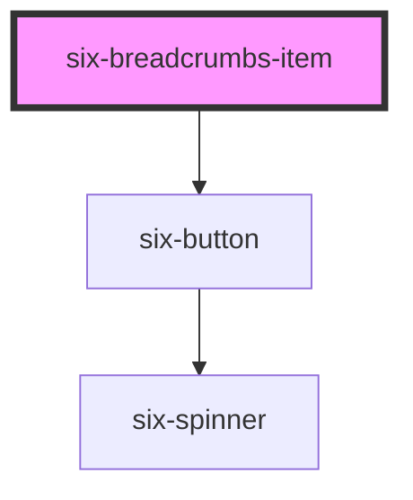

# six-breadcrumb-item

<!-- Auto Generated Below -->

## Properties

| Property   | Attribute   | Description                                                                                            | Type                                                      | Default     |
| ---------- | ----------- | ------------------------------------------------------------------------------------------------------ | --------------------------------------------------------- | ----------- |
| `href`     | `href`      | When set, the underlying button will be rendered as an `<a>` with this `href` instead of a `<button>`. | `string \| undefined`                                     | `undefined` |
| `readonly` | `read-only` | Set to true to readonly the breadcrumb item.                                                           | `boolean`                                                 | `false`     |
| `size`     | `size`      | The button's size.                                                                                     | `"large" \| "medium" \| "small"`                          | `'medium'`  |
| `target`   | `target`    | Tells the browser where to open the link. Only used when `href` is set.                                | `"_blank" \| "_parent" \| "_self" \| "_top" \| undefined` | `undefined` |

## Events

| Event       | Description                                  | Type                     |
| ----------- | -------------------------------------------- | ------------------------ |
| `six-click` | Emitted when the breadcrumb item is clicked. | `CustomEvent<undefined>` |

## Shadow Parts

| Part          | Description |
| ------------- | ----------- |
| `"base"`      |             |
| `"button"`    |             |
| `"separator"` |             |

## Dependencies

### Depends on

- [six-button](../six-button)

### Graph

----------------------------------------------

Copyright © 2021-present SIX-Group
