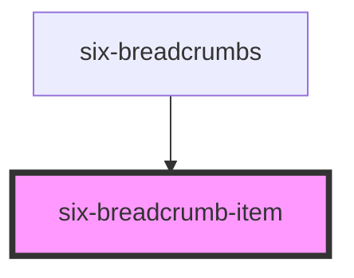

# six-breadcrumb-item

<!-- Auto Generated Below -->

## Properties

| Property   | Attribute  | Description                     | Type      | Default |
| ---------- | ---------- | ------------------------------- | --------- | ------- |
| `disabled` | `disabled` | If the breadcrumb is disabled   | `boolean` | `false` |
| `name`     | `name`     | Name or label of the breadcrumb | `string`  | `''`    |

## Events

| Event      | Description       | Type                     |
| ---------- | ----------------- | ------------------------ |
| `sixClick` | Emitted on click. | `CustomEvent<undefined>` |

## Dependencies

### Used by

 - [six-breadcrumbs](../six-breadcrumbs)

### Graph

----------------------------------------------

Copyright © 2021-present SIX-Group
