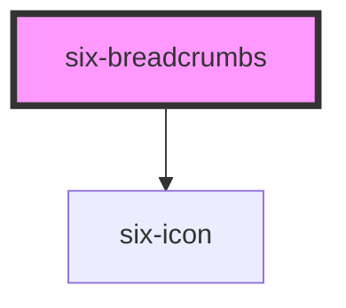

# six-breadcrumbs

<!-- EXAMPLES -->

<!-- Auto Generated Below -->

## Overview

Breadcrumbs provide a group of links so users can easily navigate a website's hierarchy.

## Properties

| Property        | Attribute        | Description | Type     | Default |
| --------------- | ---------------- | ----------- | -------- | ------- |
| `separatorIcon` | `separator-icon` |             | `string` | `''`    |

## Slots

| Slot          | Description                                                              |
| ------------- | ------------------------------------------------------------------------ |
|               | One or more breadcrumb items to display.                                 |
| `"separator"` | The separator to use between breadcrumb items. Works best with six-icon. |

## Shadow Parts

| Part     | Description                   |
| -------- | ----------------------------- |
| `"base"` | The component's base wrapper. |

## Dependencies

### Depends on

- [six-icon](../six-icon)

### Graph

----------------------------------------------

Copyright © 2021-present SIX-Group
