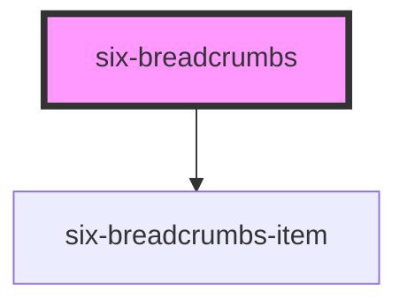

# six-breadcrumbs

<!-- Auto Generated Below -->

## Properties

| Property | Attribute | Description              | Type                 | Default |
| -------- | --------- | ------------------------ | -------------------- | ------- |
| `data`   | --        | Data for the breadcrumbs | `SixBreadcrumbsData` | `[]`    |

## Shadow Parts

| Part     | Description |
| -------- | ----------- |
| `"base"` |             |

## Dependencies

### Depends on

- [six-breadcrumbs-item](../six-breadcrumbs-item)

### Graph

----------------------------------------------

Copyright © 2021-present SIX-Group
