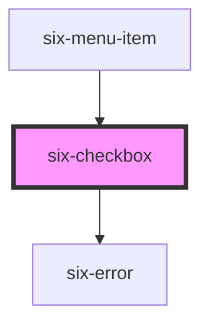

# six-checkbox

<!-- EXAMPLES -->

<!-- Auto Generated Below -->

## Properties

| Property         | Attribute          | Description                                                                                                                                                                                                                                                  | Type                  | Default     |
| ---------------- | ------------------ | ------------------------------------------------------------------------------------------------------------------------------------------------------------------------------------------------------------------------------------------------------------ | --------------------- | ----------- |
| `checked`        | `checked`          | Set to true to draw the checkbox in a checked state.                                                                                                                                                                                                         | `boolean`             | `false`     |
| `disabled`       | `disabled`         | Set to true to disable the checkbox.                                                                                                                                                                                                                         | `boolean`             | `false`     |
| `errorText`      | `error-text`       | The error message shown, if `invalid` is set to true.                                                                                                                                                                                                        | `string \| string[]`  | `''`        |
| `errorTextCount` | `error-text-count` | The number of error texts to be shown (if the error-text slot isn't used). Defaults to 1                                                                                                                                                                     | `number \| undefined` | `undefined` |
| `indeterminate`  | `indeterminate`    | Set to true to draw the checkbox in an indeterminate state.                                                                                                                                                                                                  | `boolean`             | `false`     |
| `invalid`        | `invalid`          | If this property is set to true and an error message is provided by `errorText`, the error message is displayed.                                                                                                                                             | `boolean`             | `false`     |
| `label`          | `label`            | The label text.                                                                                                                                                                                                                                              | `string`              | `''`        |
| `name`           | `name`             | The checkbox's name attribute.                                                                                                                                                                                                                               | `string`              | `''`        |
| `required`       | `required`         | Set to true to show an asterisk beneath the label.                                                                                                                                                                                                           | `boolean`             | `false`     |
| `value`          | `value`            | The value of the checkbox does not mean if it's checked or not, use the `checked` property for that.  The value of a checkbox is analogous to the value of an `<input type="checkbox">`, it's only used when the checkbox participates in a native `<form>`. | `string`              | `'on'`      |

## Events

| Event                 | Description                                       | Type                     |
| --------------------- | ------------------------------------------------- | ------------------------ |
| `six-checkbox-blur`   | Emitted when the control loses focus.             | `CustomEvent<undefined>` |
| `six-checkbox-change` | Emitted when the control's checked state changes. | `CustomEvent<undefined>` |
| `six-checkbox-focus`  | Emitted when the control gains focus.             | `CustomEvent<undefined>` |

## Methods

### `removeFocus() => Promise<void>`

Removes focus from the checkbox.

#### Returns

Type: `Promise<void>`

### `setFocus(options?: FocusOptions) => Promise<void>`

Sets focus on the checkbox.

#### Parameters

| Name      | Type                        | Description |
| --------- | --------------------------- | ----------- |
| `options` | `FocusOptions \| undefined` |             |

#### Returns

Type: `Promise<void>`

## Slots

| Slot           | Description                                                                                     |
| -------------- | ----------------------------------------------------------------------------------------------- |
| `"error-text"` | Error text that is shown for validation errors. Alternatively, you can use the error-text prop. |
| `"label"`      | The checkbox label.                                                                             |

## Shadow Parts

| Part                   | Description                                      |
| ---------------------- | ------------------------------------------------ |
| `"base"`               | The component's base wrapper.                    |
| `"checked-icon"`       | The container the wraps the checked icon.        |
| `"control"`            | The checkbox control.                            |
| `"indeterminate-icon"` | The container that wraps the indeterminate icon. |
| `"text"`               | The checkbox text rendered to the right.         |

## Dependencies

### Used by

 - [six-menu-item](../six-menu-item)

### Depends on

- [six-error](../six-error)

### Graph

----------------------------------------------

Copyright © 2021-present SIX-Group
