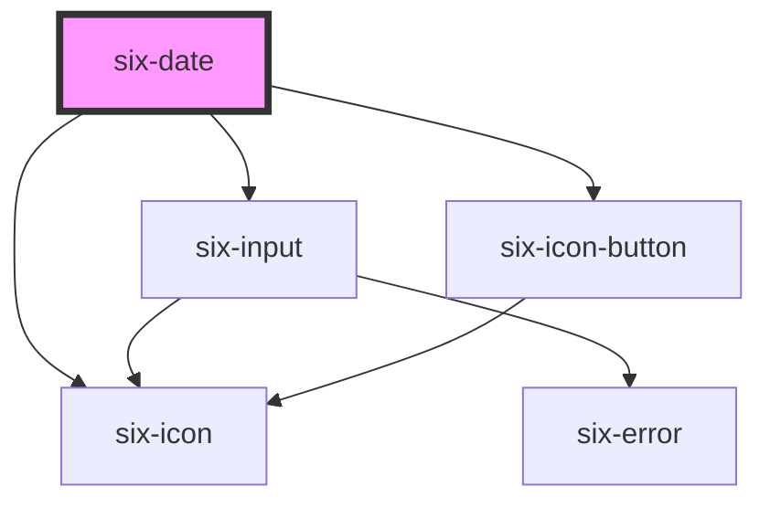

# six-date

<!-- EXAMPLES -->

<!-- Auto Generated Below -->

## Properties

| Property         | Attribute          | Description                                                                                                                                                                                                         | Type                                                                                                  | Default                 |
| ---------------- | ------------------ | ------------------------------------------------------------------------------------------------------------------------------------------------------------------------------------------------------------------- | ----------------------------------------------------------------------------------------------------- | ----------------------- |
| `allowedDates`   | --                 | Callback to determine which dates in the picker should be selectable.                                                                                                                                               | `` (date: `${number}${number}${number}${number}-${number}${number}-${number}${number}`) => boolean `` | `() => true`            |
| `clearable`      | `clearable`        | Set to true to add a clear button when the input is populated.                                                                                                                                                      | `boolean`                                                                                             | `false`                 |
| `dateFormat`     | `date-format`      | Define the dateFormat. Defaults to "dd.MM.yyyy".  Available patterns: - Year: "yyyy" (e.g., "2021") - Month: "MM" (e.g., "01" for January, "12" for December) - Day: "dd" (e.g., "08" for the 8th day of the month) | `string`                                                                                              | `'dd.MM.yyyy'`          |
| `debounce`       | `debounce`         | Set the amount of time, in milliseconds, to wait to trigger the `dateChange` event after each keystroke.                                                                                                            | `number`                                                                                              | `DEFAULT_DEBOUNCE_FAST` |
| `disabled`       | `disabled`         | If `true` the component is disabled.                                                                                                                                                                                | `boolean`                                                                                             | `false`                 |
| `errorText`      | `error-text`       | The error message shown, if `invalid` is set to true.                                                                                                                                                               | `string \| string[]`                                                                                  | `''`                    |
| `errorTextCount` | `error-text-count` | The number of error texts to be shown (if the error-text slot isn't used). Defaults to 1                                                                                                                            | `number \| undefined`                                                                                 | `undefined`             |
| `helpText`       | `help-text`        | The input's help text. Alternatively, you can use the help-text slot.                                                                                                                                               | `string`                                                                                              | `''`                    |
| `invalid`        | `invalid`          | If this property is set to true and an error message is provided by `errorText`, the error message is displayed.                                                                                                    | `boolean`                                                                                             | `false`                 |
| `label`          | `label`            | The label text.                                                                                                                                                                                                     | `string`                                                                                              | `''`                    |
| `language`       | `language`         | The language used to render the weekdays and months.                                                                                                                                                                | `"de" \| "en" \| "es" \| "fr" \| "it"`                                                                | `'en'`                  |
| `max`            | `max`              | The maximum date allowed.Value must be an iso-date string.                                                                                                                                                          | `` `${number}${number}${number}${number}-${number}${number}-${number}${number}` \| undefined ``       | `undefined`             |
| `min`            | `min`              | The minimum date allowed. Value must be an iso-date string.                                                                                                                                                         | `` `${number}${number}${number}${number}-${number}${number}-${number}${number}` \| undefined ``       | `undefined`             |
| `name`           | `name`             | The input's name attribute.                                                                                                                                                                                         | `string`                                                                                              | `''`                    |
| `placeholder`    | `placeholder`      | The placeholder defines what text to be shown on the input element                                                                                                                                                  | `string \| undefined`                                                                                 | `undefined`             |
| `readonly`       | `readonly`         | If `true` the user can only select a date via the component in the popup, but not directly edit the input field.                                                                                                    | `boolean`                                                                                             | `false`                 |
| `required`       | `required`         | Set to true to show an asterisk beneath the label.                                                                                                                                                                  | `boolean`                                                                                             | `false`                 |
| `size`           | `size`             | Dates size.                                                                                                                                                                                                         | `"large" \| "medium" \| "small"`                                                                      | `'medium'`              |
| `value`          | `value`            | The value of the form field, which accepts a date object.                                                                                                                                                           | `` "" \| `${number}${number}${number}${number}-${number}${number}-${number}${number}` ``              | `''`                    |

## Events

| Event       | Description                               | Type                                                                                              |
| ----------- | ----------------------------------------- | ------------------------------------------------------------------------------------------------- |
| `sixBlur`   | Emitted when the control loses focus.     | `CustomEvent<any>`                                                                                |
| `sixChange` | Emitted when the control's value changes. | `CustomEvent<"" \| `${number}${number}${number}${number}-${number}${number}-${number}${number}`>` |

## Methods

### `setFocus(options?: FocusOptions) => Promise<void>`

Sets focus on the input.

#### Parameters

| Name      | Type                        | Description |
| --------- | --------------------------- | ----------- |
| `options` | `FocusOptions \| undefined` |             |

#### Returns

Type: `Promise<void>`

## Slots

| Slot           | Description                                                                                         |
| -------------- | --------------------------------------------------------------------------------------------------- |
| `"error-text"` | Error text that is shown for validation errors. Alternatively, you can use the error-text property. |
| `"help-text"`  | Help text that describes the usage.                                                                 |
| `"label"`      | The date's label. Alternatively, you can use the label prop.                                        |

## Dependencies

### Depends on

- [six-input](../six-input)
- [six-icon](../six-icon)
- [six-icon-button](../six-icon-button)

### Graph

----------------------------------------------

Copyright © 2021-present SIX-Group
