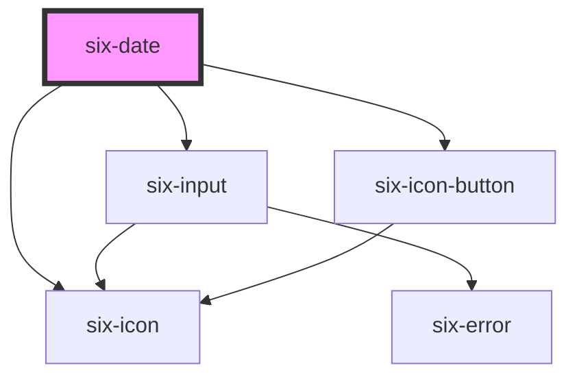

# six-date

<!-- EXAMPLES -->

<!-- Auto Generated Below -->

## Overview

A date picker component that allows users to select dates via a calendar popup or direct input.

## Properties

| Property         | Attribute          | Description                                                                                                                                                                                                                                                                                                                                                                                                                                                                                                                                                                                                                                                                                                       | Type                                   | Default        |
| ---------------- | ------------------ | ----------------------------------------------------------------------------------------------------------------------------------------------------------------------------------------------------------------------------------------------------------------------------------------------------------------------------------------------------------------------------------------------------------------------------------------------------------------------------------------------------------------------------------------------------------------------------------------------------------------------------------------------------------------------------------------------------------------- | -------------------------------------- | -------------- |
| `allowedDates`   | `allowed-dates`    | Callback to determine which dates in the picker should be selectable.                                                                                                                                                                                                                                                                                                                                                                                                                                                                                                                                                                                                                                             | `(date: string) => boolean`            | `() => true`   |
| `clearable`      | `clearable`        | Set to true to add a clear button when the input is populated.                                                                                                                                                                                                                                                                                                                                                                                                                                                                                                                                                                                                                                                    | `boolean`                              | `false`        |
| `dateFormat`     | `date-format`      | Defines the format pattern for displaying dates and how dates can be entered via keyboard.  The parser accepts flexible input that doesn't strictly match the format pattern. Input with missing leading zeros or incomplete years will be automatically normalized. For example, with the pattern "dd.MM.yyyy": "1.1.2025" becomes "01.01.2025" and "1.1.225" becomes "01.01.0225".  Defaults to "dd.MM.yyyy".  Available patterns: - Year: "yyyy" (e.g., "2021") - Month: "MM" (e.g., "01" for January) or "M" (e.g., "1" for January) - Day: "dd" (e.g., "08" for the 8th) or "d" (e.g., "8" for the 8th)  Examples: - "dd.MM.yyyy" -> "31.01.2024" - "yyyy-MM-dd" -> "2024-01-31" - "d.M.yyyy" -> "31.1.2024" | `string`                               | `'dd.MM.yyyy'` |
| `disabled`       | `disabled`         | If `true` the component is disabled.                                                                                                                                                                                                                                                                                                                                                                                                                                                                                                                                                                                                                                                                              | `boolean`                              | `false`        |
| `errorText`      | `error-text`       | The error message shown, if `invalid` is set to true.                                                                                                                                                                                                                                                                                                                                                                                                                                                                                                                                                                                                                                                             | `string \| string[]`                   | `''`           |
| `errorTextCount` | `error-text-count` | The number of error texts to be shown (if the error-text slot isn't used). Defaults to 1                                                                                                                                                                                                                                                                                                                                                                                                                                                                                                                                                                                                                          | `number \| undefined`                  | `undefined`    |
| `helpText`       | `help-text`        | The input's help text. Alternatively, you can use the help-text slot.                                                                                                                                                                                                                                                                                                                                                                                                                                                                                                                                                                                                                                             | `string`                               | `''`           |
| `invalid`        | `invalid`          | If this property is set to true and an error message is provided by `errorText`, the error message is displayed.                                                                                                                                                                                                                                                                                                                                                                                                                                                                                                                                                                                                  | `boolean`                              | `false`        |
| `label`          | `label`            | The label text.                                                                                                                                                                                                                                                                                                                                                                                                                                                                                                                                                                                                                                                                                                   | `string`                               | `''`           |
| `language`       | `language`         | The language used to render the weekdays and months.                                                                                                                                                                                                                                                                                                                                                                                                                                                                                                                                                                                                                                                              | `"de" \| "en" \| "es" \| "fr" \| "it"` | `'en'`         |
| `max`            | `max`              | The maximum allowed selectable date in ISO format (yyyy-MM-dd). Dates after this value will be disabled in the date picker. Example: '2025-01-01'                                                                                                                                                                                                                                                                                                                                                                                                                                                                                                                                                                 | `string \| undefined`                  | `undefined`    |
| `min`            | `min`              | The minimum allowed selectable date in ISO format (yyyy-MM-dd). Dates before this value will be disabled in the date picker. Example: '2024-01-01'                                                                                                                                                                                                                                                                                                                                                                                                                                                                                                                                                                | `string \| undefined`                  | `undefined`    |
| `name`           | `name`             | The input's name attribute.                                                                                                                                                                                                                                                                                                                                                                                                                                                                                                                                                                                                                                                                                       | `string`                               | `''`           |
| `placeholder`    | `placeholder`      | The placeholder defines what text to be shown on the input element                                                                                                                                                                                                                                                                                                                                                                                                                                                                                                                                                                                                                                                | `string \| undefined`                  | `undefined`    |
| `readonly`       | `readonly`         | If `true` the user can only select a date via the component in the popup but not directly edit the input field.                                                                                                                                                                                                                                                                                                                                                                                                                                                                                                                                                                                                   | `boolean`                              | `false`        |
| `required`       | `required`         | Set to true to show an asterisk beneath the label.                                                                                                                                                                                                                                                                                                                                                                                                                                                                                                                                                                                                                                                                | `boolean`                              | `false`        |
| `size`           | `size`             | The size of the date input field.                                                                                                                                                                                                                                                                                                                                                                                                                                                                                                                                                                                                                                                                                 | `"large" \| "medium" \| "small"`       | `'medium'`     |
| `value`          | `value`            | The value of the form field in ISO 8601 date format (yyyy-MM-dd). Example: '2024-01-01'.  When an invalid date is provided, it will be replaced with an empty string (''), matching the behavior of native HTML <input type="date">.  The displayed format can be customized using the dateFormat property, but the underlying value will always be stored in ISO format.                                                                                                                                                                                                                                                                                                                                         | `string`                               | `''`           |

## Events

| Event        | Description                                                                                                                                  | Type                  |
| ------------ | -------------------------------------------------------------------------------------------------------------------------------------------- | --------------------- |
| `six-blur`   | Emitted when the control loses focus or the date picker popup is closed. Does not contain event details.                                     | `CustomEvent<any>`    |
| `six-change` | Emitted when the control's value changes. Event detail contains the new date value in ISO format (yyyy-MM-dd) or an empty string if cleared. | `CustomEvent<string>` |

## Methods

### `setFocus(options?: FocusOptions) => Promise<void>`

Sets focus on the input.

#### Parameters

| Name      | Type                        | Description |
| --------- | --------------------------- | ----------- |
| `options` | `FocusOptions \| undefined` |             |

#### Returns

Type: `Promise<void>`

## Slots

| Slot           | Description                                                                                         |
| -------------- | --------------------------------------------------------------------------------------------------- |
| `"error-text"` | Error text that is shown for validation errors. Alternatively, you can use the error-text property. |
| `"help-text"`  | Help text that describes the usage.                                                                 |
| `"label"`      | The date's label. Alternatively, you can use the label prop.                                        |

## Dependencies

### Depends on

- [six-input](../six-input)
- [six-icon](../six-icon)
- [six-icon-button](../six-icon-button)

### Graph

----------------------------------------------

Copyright © 2021-present SIX-Group
