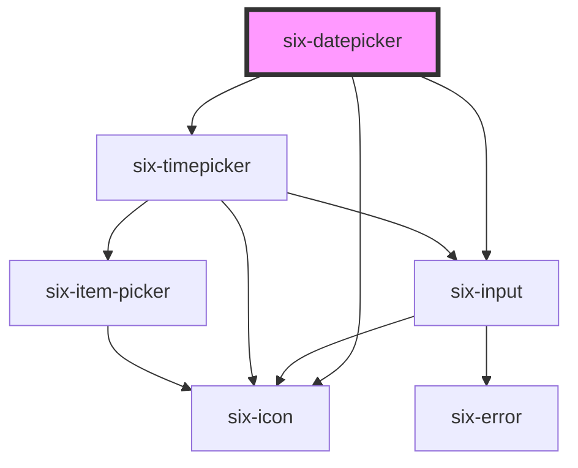

# six-datepicker

<!-- EXAMPLES -->

<!-- Auto Generated Below -->

## Properties

| Property            | Attribute          | Description                                                                                                                                                                                                                                                                                                                      | Type                                                                                                                                                                                                                                                                                                                                                                                                                                                                                                                                                                                                                                                                                           | Default                      |
| ------------------- | ------------------ | -------------------------------------------------------------------------------------------------------------------------------------------------------------------------------------------------------------------------------------------------------------------------------------------------------------------------------- | ---------------------------------------------------------------------------------------------------------------------------------------------------------------------------------------------------------------------------------------------------------------------------------------------------------------------------------------------------------------------------------------------------------------------------------------------------------------------------------------------------------------------------------------------------------------------------------------------------------------------------------------------------------------------------------------------- | ---------------------------- |
| `allowedDates`      | --                 | Callback to determine which date in the datepicker should be selectable. the callback function will get a datestring as an argument, e.g. '2021-07-04'  Usage e.g.: const datepicker = document.getElementById('allowed-date-picker'); datepicker.allowedDates = datestring => parseInt(datestring.split('-')[2], 10) % 2 === 0; | `(date: Date) => boolean`                                                                                                                                                                                                                                                                                                                                                                                                                                                                                                                                                                                                                                                                      | `() => true`                 |
| `clearable`         | `clearable`        | Set to true to add a clear button when the input is populated.                                                                                                                                                                                                                                                                   | `boolean`                                                                                                                                                                                                                                                                                                                                                                                                                                                                                                                                                                                                                                                                                      | `false`                      |
| `closeOnSelect`     | `close-on-select`  | Closes the datepicker dropdown after selection                                                                                                                                                                                                                                                                                   | `boolean`                                                                                                                                                                                                                                                                                                                                                                                                                                                                                                                                                                                                                                                                                      | `this.type === 'date'`       |
| `containingElement` | --                 | The dropdown will close when the user interacts outside of this element (e.g. clicking).                                                                                                                                                                                                                                         | `HTMLElement \| undefined`                                                                                                                                                                                                                                                                                                                                                                                                                                                                                                                                                                                                                                                                     | `undefined`                  |
| `dateFormat`        | `date-format`      | Define the dateFormat. Valid formats are: 'dd.mm.yyyy' 'yyyy-mm-dd' 'dd-mm-yyyy' 'dd/mm/yyyy' 'yyyy/mm/dd' 'dd.mm.yy' 'yy-mm-dd' 'dd-mm-yy' 'dd/mm/yy' 'yy/mm/dd'                                                                                                                                                                | `SixDateFormats.DDMMYYYY_DASH \| SixDateFormats.DDMMYYYY_DASH_TIME \| SixDateFormats.DDMMYYYY_SLASH \| SixDateFormats.DDMMYYYY_SLASH_TIME \| SixDateFormats.DDMMYYY_DOT \| SixDateFormats.DDMMYYY_DOT_TIME \| SixDateFormats.DDMMYY_DASH \| SixDateFormats.DDMMYY_DASH_TIME \| SixDateFormats.DDMMYY_DOT \| SixDateFormats.DDMMYY_DOT_TIME \| SixDateFormats.DDMMYY_SLASH \| SixDateFormats.DDMMYY_SLASH_TIME \| SixDateFormats.YYMMDD_DASH \| SixDateFormats.YYMMDD_DASH_TIME \| SixDateFormats.YYMMDD_SLASH \| SixDateFormats.YYMMDD_SLASH_TIME \| SixDateFormats.YYYYMMDD_DASH \| SixDateFormats.YYYYMMDD_DASH_TIME \| SixDateFormats.YYYYMMDD_SLASH \| SixDateFormats.YYYYMMDD_SLASH_TIME` | `SixDateFormats.DDMMYYY_DOT` |
| `debounce`          | `debounce`         | Set the amount of time, in milliseconds, to wait to trigger the `dateChange` event after each keystroke.                                                                                                                                                                                                                         | `number`                                                                                                                                                                                                                                                                                                                                                                                                                                                                                                                                                                                                                                                                                       | `DEFAULT_DEBOUNCE_FAST`      |
| `defaultDate`       | `default-date`     | The date to defines where the datepicker popup starts. The prop accepts ISO 8601 date strings (YYYY-MM-DD).                                                                                                                                                                                                                      | `string \| undefined`                                                                                                                                                                                                                                                                                                                                                                                                                                                                                                                                                                                                                                                                          | `undefined`                  |
| `disabled`          | `disabled`         | If `true` the component is disabled.                                                                                                                                                                                                                                                                                             | `boolean`                                                                                                                                                                                                                                                                                                                                                                                                                                                                                                                                                                                                                                                                                      | `false`                      |
| `errorText`         | `error-text`       | The error message shown, if `invalid` is set to true.                                                                                                                                                                                                                                                                            | `string \| string[]`                                                                                                                                                                                                                                                                                                                                                                                                                                                                                                                                                                                                                                                                           | `''`                         |
| `errorTextCount`    | `error-text-count` | The number of error texts to be shown (if the error-text slot isn't used). Defaults to 1                                                                                                                                                                                                                                         | `number \| undefined`                                                                                                                                                                                                                                                                                                                                                                                                                                                                                                                                                                                                                                                                          | `undefined`                  |
| `hoist`             | `hoist`            | Enable this option to prevent the panel from being clipped when the component is placed inside a container with `overflow: auto\|scroll`.                                                                                                                                                                                        | `boolean`                                                                                                                                                                                                                                                                                                                                                                                                                                                                                                                                                                                                                                                                                      | `false`                      |
| `iconPosition`      | `icon-position`    | Set the position of the icon                                                                                                                                                                                                                                                                                                     | `"left" \| "right"`                                                                                                                                                                                                                                                                                                                                                                                                                                                                                                                                                                                                                                                                            | `'left'`                     |
| `inline`            | `inline`           | Indicates whether or not the calendar should be shown as an inline (always open) component                                                                                                                                                                                                                                       | `boolean`                                                                                                                                                                                                                                                                                                                                                                                                                                                                                                                                                                                                                                                                                      | `false`                      |
| `invalid`           | `invalid`          | If this property is set to true and an error message is provided by `errorText`, the error message is displayed.                                                                                                                                                                                                                 | `boolean`                                                                                                                                                                                                                                                                                                                                                                                                                                                                                                                                                                                                                                                                                      | `false`                      |
| `label`             | `label`            | The label text.                                                                                                                                                                                                                                                                                                                  | `string`                                                                                                                                                                                                                                                                                                                                                                                                                                                                                                                                                                                                                                                                                       | `''`                         |
| `locale`            | `locale`           | The language used to render the weekdays and months.                                                                                                                                                                                                                                                                             | `"de" \| "en" \| "es" \| "fr" \| "it"`                                                                                                                                                                                                                                                                                                                                                                                                                                                                                                                                                                                                                                                         | `'en'`                       |
| `max`               | --                 | The maximum datetime allowed. Value must be a date object                                                                                                                                                                                                                                                                        | `Date \| undefined`                                                                                                                                                                                                                                                                                                                                                                                                                                                                                                                                                                                                                                                                            | `undefined`                  |
| `min`               | --                 | The minimum datetime allowed. Value must be a date object                                                                                                                                                                                                                                                                        | `Date \| undefined`                                                                                                                                                                                                                                                                                                                                                                                                                                                                                                                                                                                                                                                                            | `undefined`                  |
| `name`              | `name`             | The input's name attribute.                                                                                                                                                                                                                                                                                                      | `string`                                                                                                                                                                                                                                                                                                                                                                                                                                                                                                                                                                                                                                                                                       | `''`                         |
| `open`              | `open`             | Indicates whether or not the calendar dropdown is open on startup. You can use this in lieu of the show/hide methods.                                                                                                                                                                                                            | `boolean`                                                                                                                                                                                                                                                                                                                                                                                                                                                                                                                                                                                                                                                                                      | `false`                      |
| `placeholder`       | `placeholder`      | The placeholder defines what text to be shown on the input element                                                                                                                                                                                                                                                               | `string \| undefined`                                                                                                                                                                                                                                                                                                                                                                                                                                                                                                                                                                                                                                                                          | `undefined`                  |
| `placement`         | `placement`        | The enforced placement of the dropdown panel.                                                                                                                                                                                                                                                                                    | `"bottom" \| "top" \| undefined`                                                                                                                                                                                                                                                                                                                                                                                                                                                                                                                                                                                                                                                               | `undefined`                  |
| `readonly`          | `readonly`         | If `true` the user can only select a date via the component in the popup, but not directly edit the input field.                                                                                                                                                                                                                 | `boolean`                                                                                                                                                                                                                                                                                                                                                                                                                                                                                                                                                                                                                                                                                      | `false`                      |
| `required`          | `required`         | Set to true to show an asterisk beneath the label.                                                                                                                                                                                                                                                                               | `boolean`                                                                                                                                                                                                                                                                                                                                                                                                                                                                                                                                                                                                                                                                                      | `false`                      |
| `size`              | `size`             | Datepicker size.                                                                                                                                                                                                                                                                                                                 | `"large" \| "medium" \| "small"`                                                                                                                                                                                                                                                                                                                                                                                                                                                                                                                                                                                                                                                               | `'medium'`                   |
| `type`              | `type`             | Set the type.                                                                                                                                                                                                                                                                                                                    | `"date" \| "date-time"`                                                                                                                                                                                                                                                                                                                                                                                                                                                                                                                                                                                                                                                                        | `'date'`                     |
| `value`             | --                 | The value of the form field, which accepts a date object.                                                                                                                                                                                                                                                                        | `Date \| undefined`                                                                                                                                                                                                                                                                                                                                                                                                                                                                                                                                                                                                                                                                            | `undefined`                  |

## Events

| Event                   | Description                                 | Type                                     |
| ----------------------- | ------------------------------------------- | ---------------------------------------- |
| `six-datepicker-blur`   | Emitted when a option got selected.         | `CustomEvent<Date \| null \| undefined>` |
| `six-datepicker-clear`  | Emitted when the clear button is activated. | `CustomEvent<undefined>`                 |
| `six-datepicker-select` | Emitted when a option got selected.         | `CustomEvent<Date \| null \| undefined>` |

## Methods

### `select(datestring?: string) => Promise<void>`

Selects an option

#### Parameters

| Name         | Type                  | Description |
| ------------ | --------------------- | ----------- |
| `datestring` | `string \| undefined` |             |

#### Returns

Type: `Promise<void>`

### `setFocus(options?: FocusOptions) => Promise<void>`

Sets focus on the datepickers input.

#### Parameters

| Name      | Type                        | Description |
| --------- | --------------------------- | ----------- |
| `options` | `FocusOptions \| undefined` |             |

#### Returns

Type: `Promise<void>`

## Slots

| Slot           | Description                                                                                     |
| -------------- | ----------------------------------------------------------------------------------------------- |
|                | Used to define a footer for the date picker.                                                    |
| `"error-text"` | Error text that is shown for validation errors. Alternatively, you can use the error-text prop. |

## Shadow Parts

| Part       | Description |
| ---------- | ----------- |
| `"base"`   |             |
| `"header"` |             |
| `"icon"`   |             |
| `"popup"`  |             |

## Dependencies

### Depends on

- [six-icon](../six-icon)
- [six-input](../six-input)
- [six-timepicker](../six-timepicker)

### Graph

----------------------------------------------

Copyright © 2021-present SIX-Group
