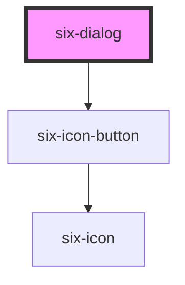

# six-dialog

<!-- EXAMPLES -->

<!-- Auto Generated Below -->

## Properties

| Property   | Attribute   | Description                                                                                                                                                              | Type      | Default |
| ---------- | ----------- | ------------------------------------------------------------------------------------------------------------------------------------------------------------------------ | --------- | ------- |
| `label`    | `label`     | The dialog's label as displayed in the header. You should always include a relevant label even when using `no-header`, as it is required for proper accessibility.       | `string`  | `''`    |
| `noHeader` | `no-header` | Set to true to disable the header. This will also remove the default close button, so please ensure you provide an easy, accessible way for users to dismiss the dialog. | `boolean` | `false` |
| `open`     | `open`      | Indicates whether the dialog is open. You can use this in lieu of the show/hide methods.                                                                                 | `boolean` | `false` |

## Events

| Event                      | Description                                                                                                                                                                                                                                                                              | Type                                 |
| -------------------------- | ---------------------------------------------------------------------------------------------------------------------------------------------------------------------------------------------------------------------------------------------------------------------------------------- | ------------------------------------ |
| `six-dialog-after-hide`    | Emitted after the dialog closes and all transitions are complete.                                                                                                                                                                                                                        | `CustomEvent<undefined>`             |
| `six-dialog-after-show`    | Emitted after the dialog opens and all transitions are complete.                                                                                                                                                                                                                         | `CustomEvent<undefined>`             |
| `six-dialog-hide`          | Emitted when the dialog closes. Calling `event.preventDefault()` will prevent it from being closed.                                                                                                                                                                                      | `CustomEvent<undefined>`             |
| `six-dialog-initial-focus` | Emitted when the dialog opens and the panel gains focus. Calling `event.preventDefault()` will prevent focus and allow you to set it on a different element in the dialog, such as an input or button.                                                                                   | `CustomEvent<undefined>`             |
| `six-dialog-request-close` | Emitted when the user attempts to close the drawer by clicking the close button, clicking the overlay, or pressing escape. Calling `event.preventDefault()` will keep the drawer open. Avoid using this unless closing the drawer will result in destructive behavior such as data loss. | `CustomEvent<SixDialogRequestClose>` |
| `six-dialog-show`          | Emitted when the dialog opens. Calling `event.preventDefault()` will prevent it from being opened.                                                                                                                                                                                       | `CustomEvent<undefined>`             |

## Methods

### `hide() => Promise<void>`

Hides the dialog

#### Returns

Type: `Promise<void>`

### `show() => Promise<void>`

Shows the dialog

#### Returns

Type: `Promise<void>`

## Slots

| Slot       | Description                                                                    |
| ---------- | ------------------------------------------------------------------------------ |
|            | The dialog's content.                                                          |
| `"footer"` | The dialog's footer, usually one or more buttons representing various options. |
| `"label"`  | The dialog's label. Alternatively, you can use the label prop.                 |

## Shadow Parts

| Part             | Description                                                      |
| ---------------- | ---------------------------------------------------------------- |
| `"base"`         | The component's base wrapper.                                    |
| `"body"`         | The dialog body.                                                 |
| `"close-button"` | The close button.                                                |
| `"footer"`       | The dialog footer.                                               |
| `"header"`       | The dialog header.                                               |
| `"overlay"`      | The overlay.                                                     |
| `"panel"`        | The dialog panel (where the dialog and its content is rendered). |
| `"title"`        | The dialog title.                                                |

## CSS Custom Properties

| Name      | Description                                                                                         |
| --------- | --------------------------------------------------------------------------------------------------- |
| `--width` | The preferred width of the dialog. Note that the dialog will shrink to accommodate smaller screens. |

## Dependencies

### Depends on

- [six-icon-button](../six-icon-button)

### Graph

----------------------------------------------

Copyright © 2021-present SIX-Group
