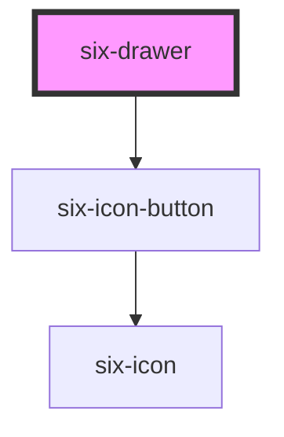

# six-drawer

Drawers slide in from a container to expose additional options and information. Drawers are used when the user
has to do a context switch and do an intermediary task (Drawers are full height or width and will overlay the rest of the application).
For a passive side container use six-sidebar instead (could be always open).

<!-- EXAMPLES -->

<!-- Auto Generated Below -->

## Properties

| Property    | Attribute   | Description                                                                                                                                                                                     | Type                                     | Default   |
| ----------- | ----------- | ----------------------------------------------------------------------------------------------------------------------------------------------------------------------------------------------- | ---------------------------------------- | --------- |
| `contained` | `contained` | By default, the drawer slides out of its containing block (usually the viewport). To make the drawer slide out of its parent element, set this prop and add `position: relative` to the parent. | `boolean`                                | `false`   |
| `label`     | `label`     | The drawer's label as displayed in the header. You should always include a relevant label even when using `no-header`, as it is required for proper accessibility.                              | `string`                                 | `''`      |
| `noHeader`  | `no-header` | Removes the header. This will also remove the default close button, so please ensure you provide an easy, accessible way for users to dismiss the drawer.                                       | `boolean`                                | `false`   |
| `open`      | `open`      | Indicates whether the drawer is open. You can use this in lieu of the show/hide methods.                                                                                                        | `boolean`                                | `false`   |
| `placement` | `placement` | The direction from which the drawer will open.                                                                                                                                                  | `"bottom" \| "left" \| "right" \| "top"` | `'right'` |

## Events

| Event                      | Description                                                                                                                                                                                                                                                                              | Type                                 |
| -------------------------- | ---------------------------------------------------------------------------------------------------------------------------------------------------------------------------------------------------------------------------------------------------------------------------------------- | ------------------------------------ |
| `six-drawer-after-hide`    | Emitted after the drawer closes and all transitions are complete.                                                                                                                                                                                                                        | `CustomEvent<undefined>`             |
| `six-drawer-after-show`    | Emitted after the drawer opens and all transitions are complete.                                                                                                                                                                                                                         | `CustomEvent<undefined>`             |
| `six-drawer-hide`          | Emitted when the drawer closes. Calling `event.preventDefault()` will prevent it from being closed.                                                                                                                                                                                      | `CustomEvent<undefined>`             |
| `six-drawer-initial-focus` | Emitted when the drawer opens and the panel gains focus. Calling `event.preventDefault()` will prevent focus and allow you to set it on a different element in the drawer, such as an input or button.                                                                                   | `CustomEvent<undefined>`             |
| `six-drawer-request-close` | Emitted when the user attempts to close the drawer by clicking the close button, clicking the overlay, or pressing escape. Calling `event.preventDefault()` will keep the drawer open. Avoid using this unless closing the drawer will result in destructive behavior such as data loss. | `CustomEvent<SixDrawerRequestClose>` |
| `six-drawer-show`          | Emitted when the drawer opens. Calling `event.preventDefault()` will prevent it from being opened.                                                                                                                                                                                       | `CustomEvent<undefined>`             |

## Methods

### `hide() => Promise<void>`

Hides the drawer

#### Returns

Type: `Promise<void>`

### `show() => Promise<void>`

Shows the drawer

#### Returns

Type: `Promise<void>`

## Slots

| Slot       | Description                                                                    |
| ---------- | ------------------------------------------------------------------------------ |
|            | The drawer's content.                                                          |
| `"footer"` | The drawer's footer, usually one or more buttons representing various options. |
| `"label"`  | The drawer's label. Alternatively, you can use the label prop.                 |

## Shadow Parts

| Part             | Description                                                      |
| ---------------- | ---------------------------------------------------------------- |
| `"base"`         | The component's base wrapper.                                    |
| `"body"`         | The drawer body.                                                 |
| `"close-button"` | The close button.                                                |
| `"footer"`       | The drawer footer.                                               |
| `"header"`       | The drawer header.                                               |
| `"overlay"`      | The overlay.                                                     |
| `"panel"`        | The drawer panel (where the drawer and its content is rendered). |
| `"title"`        | The drawer title.                                                |

## Dependencies

### Depends on

- [six-icon-button](../six-icon-button)

### Graph

----------------------------------------------

Copyright © 2021-present SIX-Group
