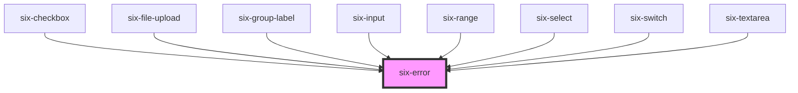

# six-error

<!-- Auto Generated Below -->

## Slots

| Slot        | Description                 |
| ----------- | --------------------------- |
| `"default"` | The error's message content |

## Dependencies

### Used by

 - [six-checkbox](../six-checkbox)
 - [six-file-upload](../six-file-upload)
 - [six-group-label](../six-group-label)
 - [six-input](../six-input)
 - [six-range](../six-range)
 - [six-select](../six-select)
 - [six-switch](../six-switch)
 - [six-textarea](../six-textarea)

### Graph

----------------------------------------------

Copyright © 2021-present SIX-Group
