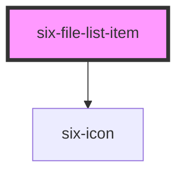

# six-file-list-item

<!-- EXAMPLES -->

<!-- Auto Generated Below -->

## Properties

| Property     | Attribute    | Description                                                                   | Type                  | Default     |
| ------------ | ------------ | ----------------------------------------------------------------------------- | --------------------- | ----------- |
| `date`       | `date`       | The date when the file was uploaded                                           | `string`              | `''`        |
| `identifier` | `identifier` | An id to clearly identify the file                                            | `string`              | `''`        |
| `name`       | `name`       | The filename                                                                  | `string`              | `''`        |
| `nodelete`   | `nodelete`   | Set to true if you don't want to allow to delete this file                    | `boolean`             | `false`     |
| `nodownload` | `nodownload` | Set to true if you don't want to allow to download this file                  | `boolean`             | `false`     |
| `size`       | `size`       | The file size. This number will be divided by 1024 to show the filesize in KB | `number \| undefined` | `undefined` |

## Events

| Event                         | Description                 | Type                                      |
| ----------------------------- | --------------------------- | ----------------------------------------- |
| `six-file-list-item-download` | Triggered on file download. | `CustomEvent<SixFileListDownloadPayload>` |
| `six-file-list-item-remove`   | Triggered on file remove.   | `CustomEvent<SixFileListRemovePayload>`   |

## Dependencies

### Depends on

- [six-icon](../six-icon)

### Graph

----------------------------------------------

Copyright © 2021-present SIX-Group
