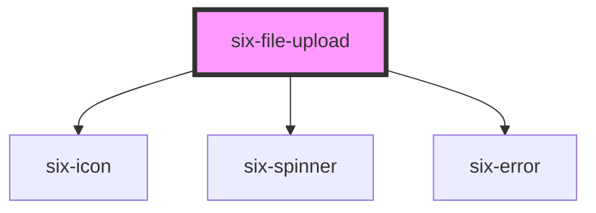

# six-file-upload

<!-- EXAMPLES -->

<!-- Auto Generated Below -->

## Properties

| Property      | Attribute       | Description                                                                                                      | Type                  | Default     |
| ------------- | --------------- | ---------------------------------------------------------------------------------------------------------------- | --------------------- | ----------- |
| `accept`      | `accept`        | Accepted MIME-Types.                                                                                             | `string \| undefined` | `undefined` |
| `compact`     | `compact`       | Set to true if file control should be small.                                                                     | `boolean`             | `false`     |
| `disabled`    | `disabled`      | Set when button is disabled.                                                                                     | `boolean`             | `false`     |
| `errorText`   | `error-text`    | The error message shown, if `invalid` is set to true.                                                            | `string \| string[]`  | `''`        |
| `invalid`     | `invalid`       | If this property is set to true and an error message is provided by `errorText`, the error message is displayed. | `boolean`             | `false`     |
| `label`       | `label`         | Label of the drop area.                                                                                          | `string \| undefined` | `undefined` |
| `maxFileSize` | `max-file-size` | Allowed max file size in bytes.                                                                                  | `number \| undefined` | `undefined` |
| `multiple`    | `multiple`      | More than one file allowed.                                                                                      | `boolean`             | `false`     |
| `uploading`   | `uploading`     | Set to true to draw the control in a loading state.                                                              | `boolean`             | `false`     |

## Events

| Event                     | Description                                                              | Type                                         |
| ------------------------- | ------------------------------------------------------------------------ | -------------------------------------------- |
| `six-file-upload-failure` | Triggers when an uploaded file doesn't match MIME type or max file size. | `CustomEvent<SixFileUploadFailurePayload>`   |
| `six-file-upload-success` | Triggers when a file is added.                                           | `CustomEvent<IMultipleFiles \| ISingleFile>` |

## Dependencies

### Depends on

- [six-icon](../six-icon)
- [six-spinner](../six-spinner)
- [six-error](../six-error)

### Graph

----------------------------------------------

Copyright © 2021-present SIX-Group
