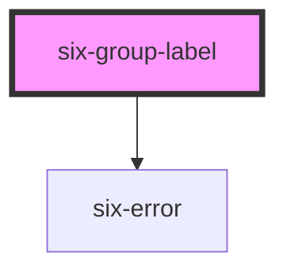

# six-group-label

<!-- EXAMPLES -->

<!-- Auto Generated Below -->

## Properties

| Property   | Attribute   | Description                                                                   | Type                             | Default    |
| ---------- | ----------- | ----------------------------------------------------------------------------- | -------------------------------- | ---------- |
| `disabled` | `disabled`  | Set to true to disable the label.                                             | `boolean`                        | `false`    |
| `helpText` | `help-text` | The wrapper label's help text. Alternatively, you can use the help-text slot. | `string`                         | `''`       |
| `label`    | `label`     | The wrapper label's label. Alternatively, you can use the label slot.         | `string`                         | `''`       |
| `required` | `required`  | Set to true to show an asterisk beneath the label.                            | `boolean`                        | `false`    |
| `size`     | `size`      | The label's size.                                                             | `"large" \| "medium" \| "small"` | `'medium'` |

## Slots

| Slot           | Description                                                                                     |
| -------------- | ----------------------------------------------------------------------------------------------- |
| `"error-text"` | Error text that is shown for validation errors. Alternatively, you can use the error-text prop. |
| `"help-text"`  | Help text that describes how to use the input.                                                  |
| `"label"`      | The wrapped component's label. Alternatively, you can use the label prop.                       |

## Shadow Parts

| Part             | Description                                                     |
| ---------------- | --------------------------------------------------------------- |
| `"base"`         | The component's base wrapper.                                   |
| `"form-control"` | The form control that wraps the label, textarea, and help text. |
| `"help-text"`    | The help text of the wrapped component.                         |
| `"label"`        | The label of wrapped component.                                 |

## Dependencies

### Depends on

- [six-error](../six-error)

### Graph

----------------------------------------------

Copyright © 2021-present SIX-Group
