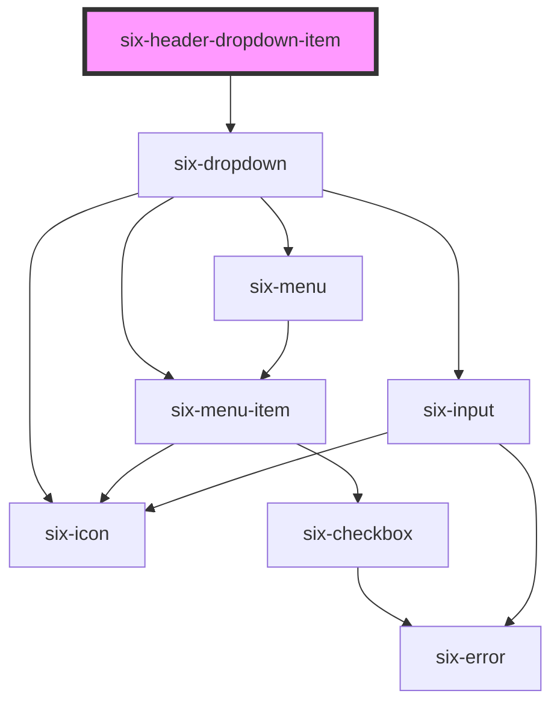

# six-header

<!-- EXAMPLES -->

<!-- Auto Generated Below -->

## Properties

| Property            | Attribute            | Description                                                                                                                                                                                                                                            | Type      | Default       |
| ------------------- | -------------------- | ------------------------------------------------------------------------------------------------------------------------------------------------------------------------------------------------------------------------------------------------------ | --------- | ------------- |
| `filter`            | `filter`             | Set to true to allow auto filtering for entries in the dropdown. With this flag the dropdown will automatically filter itsel. If you need to coordinate the shown elements yourself, e.g. because you need to call an endpoint use asyncFilter instead | `boolean` | `false`       |
| `filterPlaceholder` | `filter-placeholder` | The filter's placeholder text.                                                                                                                                                                                                                         | `string`  | `'Filter...'` |

## Dependencies

### Depends on

- [six-dropdown](../six-dropdown)

### Graph

----------------------------------------------

Copyright © 2021-present SIX-Group
