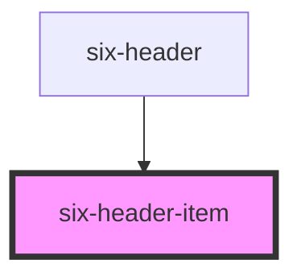

# six-header

<!-- EXAMPLES -->

<!-- Auto Generated Below -->

## Properties

| Property | Attribute | Description                                                                                                                                                                                                          | Type      | Default |
| -------- | --------- | -------------------------------------------------------------------------------------------------------------------------------------------------------------------------------------------------------------------- | --------- | ------- |
| `active` | `active`  | Indicates whether the item is styled as active. When set to `true`, a border is displayed below the trigger element.  Use <code>six-header-dropdown-item</code> to automatically set the active state for dropdowns. | `boolean` | `false` |

## Dependencies

### Used by

 - [six-header](../six-header)

### Graph

----------------------------------------------

Copyright © 2021-present SIX-Group
