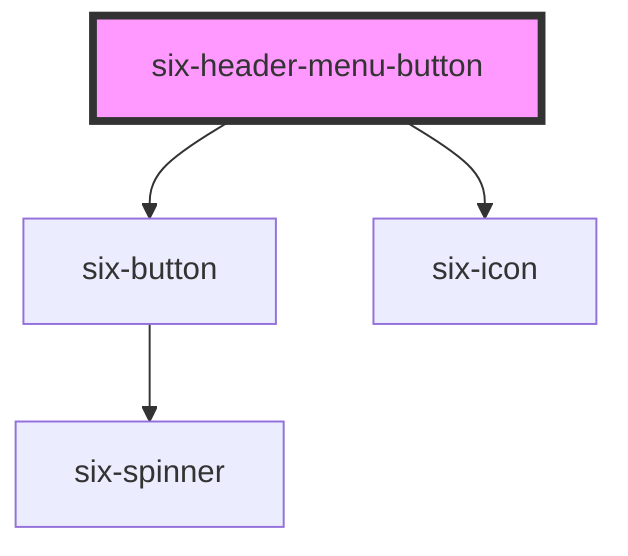

# six-header

<!-- EXAMPLES -->

<!-- Auto Generated Below -->

## Properties

| Property | Attribute | Description                  | Type     | Default |
| -------- | --------- | ---------------------------- | -------- | ------- |
| `icon`   | `icon`    | The icon of the menu button. | `string` | `''`    |

## Dependencies

### Depends on

- [six-button](../six-button)
- [six-icon](../six-icon)

### Graph

----------------------------------------------

Copyright © 2021-present SIX-Group
