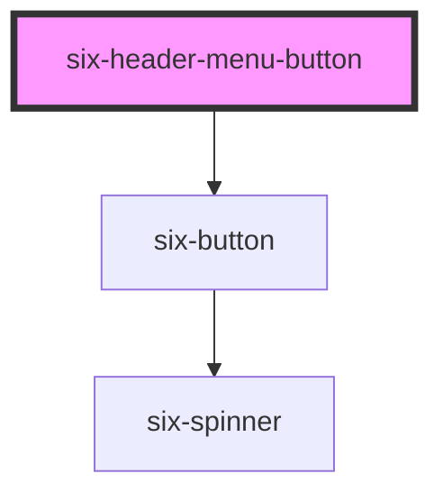

# six-header

<!-- EXAMPLES -->

<!-- Auto Generated Below -->

## Properties

| Property   | Attribute  | Description                                                                            | Type      | Default |
| ---------- | ---------- | -------------------------------------------------------------------------------------- | --------- | ------- |
| `caret`    | `caret`    | Set to true to draw the button with a caret for use with dropdowns, popovers, etc.     | `boolean` | `false` |
| `disabled` | `disabled` | Set to true to disable the button.                                                     | `boolean` | `false` |
| `loading`  | `loading`  | Set to true to draw the button in a loading state.                                     | `boolean` | `false` |
| `reset`    | `reset`    | Indicates if activating the button should reset the form.                              | `boolean` | `false` |
| `submit`   | `submit`   | Indicates if activating the button should submit the form. Ignored when `href` is set. | `boolean` | `false` |

## Dependencies

### Depends on

- [six-button](../six-button)

### Graph

----------------------------------------------

Copyright © 2021-present SIX-Group
