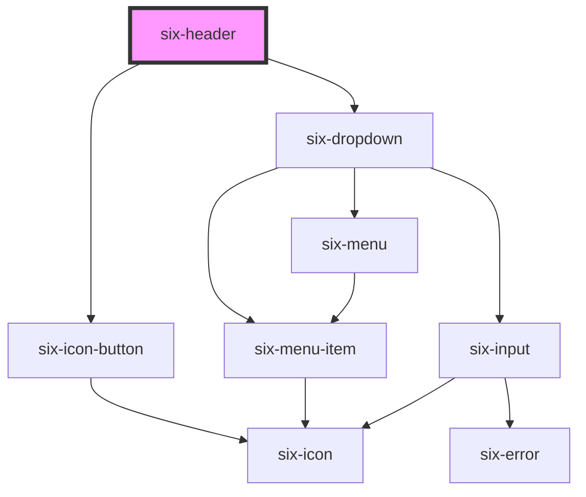

# six-header

<!-- EXAMPLES -->

<!-- Auto Generated Below -->

## Properties

| Property            | Attribute             | Description                                                               | Type      | Default |
| ------------------- | --------------------- | ------------------------------------------------------------------------- | --------- | ------- |
| `clickableLogo`     | `clickable-logo`      | Set whether the logo should be clickable                                  | `boolean` | `false` |
| `openHamburgerMenu` | `open-hamburger-menu` | Set the hamburger menu icon to open or closed state                       | `boolean` | `false` |
| `openSearch`        | `open-search`         | Set the header search to be in an open or closed state                    | `boolean` | `false` |
| `shiftContent`      | `shift-content`       | Indicates if content should be shifted down when search field is visible. | `boolean` | `false` |
| `showHamburgerMenu` | `show-hamburger-menu` | Set whether the hamburger menu should be visible or not                   | `boolean` | `true`  |

## Events

| Event                               | Description                                                       | Type                                             |
| ----------------------------------- | ----------------------------------------------------------------- | ------------------------------------------------ |
| `six-header-app-name-clicked`       | Emitted when the name of the selected app is clicked.             | `CustomEvent<undefined>`                         |
| `six-header-app-switcher-select`    | Emitted when a menu item is in the app switcher menu is selected. | `CustomEvent<SixHeaderAppSwitcherSelectPayload>` |
| `six-header-hamburger-menu-clicked` | Emitted when the hamburger menu is clicked.                       | `CustomEvent<undefined>`                         |
| `six-header-logo-clicked`           | Emitted when the header logo is clicked.                          | `CustomEvent<undefined>`                         |
| `six-header-profile-select`         | Emitted when a menu item is in the profile menu is selected.      | `CustomEvent<SixHeaderProfileSelectPayload>`     |
| `six-header-search-field-toggle`    | Emitted when search field is toggled.                             | `CustomEvent<SixHeaderSearchFieldToggle>`        |

## Methods

### `getIsSearchOpen() => Promise<boolean>`

Get open state for search

#### Returns

Type: `Promise<boolean>`

### `setSearchOpenState(openState: boolean) => Promise<void>`

Sets open state for search

#### Returns

Type: `Promise<void>`

## Slots

| Slot                  | Description                                                       |
| --------------------- | ----------------------------------------------------------------- |
|                       | Used to define a custom component that is included in the header. |
| `"app-switcher-menu"` | Used to define the application switcher menu in the header.       |
| `"notifications"`     | Used to define the notification component in the header.          |
| `"profile-avatar"`    | Used to define the avator in the header.                          |
| `"profile-menu"`      | Used to define the profile menu in the header.                    |
| `"search-field"`      | Used to define the search field component in the header.          |

## Dependencies

### Depends on

- [six-icon-button](../six-icon-button)
- [six-dropdown](../six-dropdown)

### Graph

----------------------------------------------

Copyright © 2021-present SIX-Group
