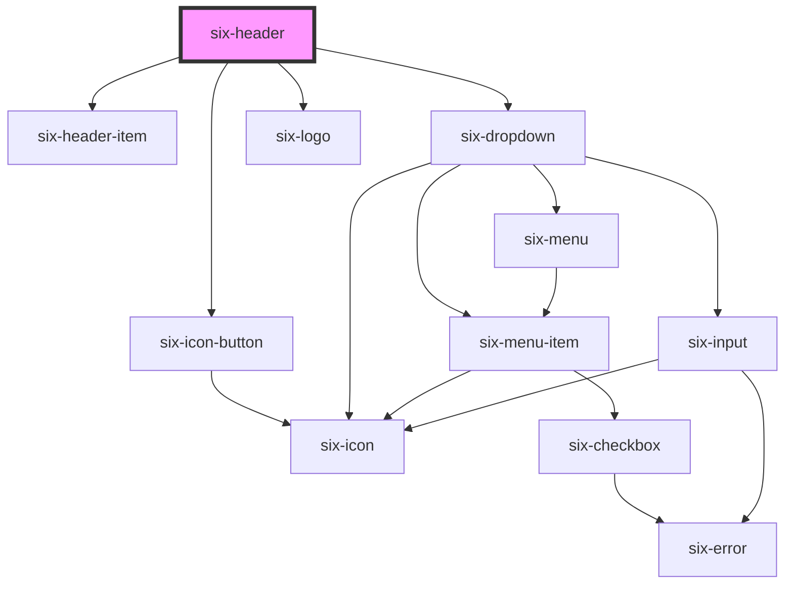

# six-header

<!-- EXAMPLES -->

<!-- Auto Generated Below -->

## Properties

| Property            | Attribute             | Description                                                                                                                                                                                                                              | Type             | Default |
| ------------------- | --------------------- | ---------------------------------------------------------------------------------------------------------------------------------------------------------------------------------------------------------------------------------------- | ---------------- | ------- |
| `clickableLogo`     | `clickable-logo`      | **[DEPRECATED]** Use six-header `custom` property with `six-logo` instead  Set whether the logo should be clickable                                                                               | `boolean`        | `false` |
| `custom`            | `custom`              | Set `custom` to `true` for complete control over the header content. When enabled, all other properties and slots are ignored.  Use `six-header-item`, `six-header-dropdown-item` and `six-header-menu-button` to structure the content. | `boolean`        | `false` |
| `hideHamburgerMenu` | `hide-hamburger-menu` | **[DEPRECATED]** Use six-header `custom` property instead  Set whether the hamburger menu should be visible or not                                                                                | `boolean`        | `false` |
| `logo`              | `logo`                | **[DEPRECATED]** Use six-header `custom` property with `six-logo` instead  The displayed logo. Either six or bme. Defaults to six.                                                                | `"bme" \| "six"` | `'six'` |
| `openHamburgerMenu` | `open-hamburger-menu` | **[DEPRECATED]** Use six-header `custom` property instead  Set the hamburger menu icon to open or closed state                                                                                    | `boolean`        | `false` |
| `openSearch`        | `open-search`         | Set the header search to be in an open or closed state.  If `custom` is `true`, focuses the first `six-input` found in the search slot.                                                                                                  | `boolean`        | `false` |
| `shiftContent`      | `shift-content`       | Indicates if content should be shifted down when search field is visible.                                                                                                                                                                | `boolean`        | `false` |

## Events

| Event                               | Description                                                                                                                                                                                                                      | Type                                             |
| ----------------------------------- | -------------------------------------------------------------------------------------------------------------------------------------------------------------------------------------------------------------------------------- | ------------------------------------------------ |
| `six-header-app-name-clicked`       | **[DEPRECATED]** Use six-header `custom` property with `six-header-dropdown-item` and `six-header-menu-button` instead  Emitted when the name of the selected app is clicked.             | `CustomEvent<undefined>`                         |
| `six-header-app-switcher-select`    | **[DEPRECATED]** Use six-header `custom` property with `six-header-dropdown-item` and `six-header-menu-button` instead  Emitted when a menu item is in the app switcher menu is selected. | `CustomEvent<SixHeaderAppSwitcherSelectPayload>` |
| `six-header-hamburger-menu-clicked` | **[DEPRECATED]** Use six-header `custom` property instead  Emitted when the hamburger menu is clicked.                                                                                    | `CustomEvent<undefined>`                         |
| `six-header-logo-clicked`           | **[DEPRECATED]** Use six-header `custom` property instead  Emitted when the header logo is clicked.                                                                                       | `CustomEvent<undefined>`                         |
| `six-header-profile-select`         | **[DEPRECATED]** Use six-header `custom` property with `six-header-dropdown-item` and `six-avatar` instead  Emitted when a menu item is in the profile menu is selected.                  | `CustomEvent<SixHeaderProfileSelectPayload>`     |
| `six-header-search-field-toggle`    | **[DEPRECATED]** Use six-header `custom` property instead  Emitted when search field is toggled.                                                                                          | `CustomEvent<SixHeaderSearchFieldToggle>`        |

## Methods

### `getIsSearchOpen() => Promise<boolean>`

**[DEPRECATED]** Use six-header `custom` property instead  Get open state for search

#### Returns

Type: `Promise<boolean>`

### `setSearchOpenState(openState: boolean) => Promise<void>`

**[DEPRECATED]** Use six-header `custom` property instead  Sets open state for search

#### Parameters

| Name        | Type      | Description |
| ----------- | --------- | ----------- |
| `openState` | `boolean` |             |

#### Returns

Type: `Promise<void>`

## Slots

| Slot                  | Description                                                                                                                                        |
| --------------------- | -------------------------------------------------------------------------------------------------------------------------------------------------- |
|                       | Used to define a custom component that is included in the header.                                                                                  |
| `"app-switcher-menu"` | [Deprecated], use six-header `custom` property instead. Used to define the application switcher menu in the header. |
| `"notifications"`     | [Deprecated], use six-header `custom` property instead. Used to define the notification component in the header.    |
| `"profile-avatar"`    | [Deprecated], use six-header `custom` property instead. Used to define the avator in the header.                    |
| `"profile-menu"`      | [Deprecated], use six-header `custom` property instead. Used to define the profile menu in the header.              |
| `"search-field"`      | Used to define the search field component in the header.                                                                                           |

## Shadow Parts

| Part       | Description |
| ---------- | ----------- |
| `"header"` |             |

## Dependencies

### Depends on

- [six-header-item](../six-header-item)
- [six-icon-button](../six-icon-button)
- [six-dropdown](../six-dropdown)
- [six-logo](../six-logo)

### Graph

----------------------------------------------

Copyright © 2021-present SIX-Group
