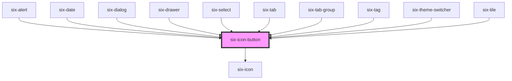

# six-icon-button

Icons buttons are simple, icon-only buttons that can be used for actions and in toolbars.

<!-- EXAMPLES -->

<!-- Auto Generated Below -->

## Properties

| Property   | Attribute  | Description                                                                                                                                                                        | Type                                                                                | Default     |
| ---------- | ---------- | ---------------------------------------------------------------------------------------------------------------------------------------------------------------------------------- | ----------------------------------------------------------------------------------- | ----------- |
| `disabled` | `disabled` | Set to true to disable the button.                                                                                                                                                 | `boolean`                                                                           | `false`     |
| `download` | `download` | Tells the browser to download the linked file as this filename. Only used when `href` is set.                                                                                      | `string \| undefined`                                                               | `undefined` |
| `href`     | `href`     | When set, the underlying button will be rendered as an `<a>` with this `href` instead of a `<button>`.                                                                             | `string \| undefined`                                                               | `undefined` |
| `html`     | `html`     | HTML symbol code or entity.                                                                                                                                                        | `string \| undefined`                                                               | `undefined` |
| `label`    | `label`    | A description that gets read by screen readers and other assistive devices. For optimal accessibility, you should always include a label that describes what the icon button does. | `string \| undefined`                                                               | `undefined` |
| `name`     | `name`     | The name of the icon to draw.                                                                                                                                                      | `string \| undefined`                                                               | `undefined` |
| `size`     | `size`     | The icon's size.                                                                                                                                                                   | `"large" \| "medium" \| "small" \| "xLarge" \| "xSmall" \| "xxLarge" \| "xxxLarge"` | `'medium'`  |
| `target`   | `target`   | Tells the browser where to open the link. Only used when `href` is set.                                                                                                            | `"_blank" \| "_parent" \| "_self" \| "_top" \| undefined`                           | `undefined` |

## Shadow Parts

| Part     | Description                   |
| -------- | ----------------------------- |
| `"base"` | The component's base wrapper. |

## Dependencies

### Used by

 - [six-alert](../six-alert)
 - [six-date](../six-date)
 - [six-dialog](../six-dialog)
 - [six-drawer](../six-drawer)
 - [six-select](../six-select)
 - [six-tab](../six-tab)
 - [six-tab-group](../six-tab-group)
 - [six-tag](../six-tag)
 - [six-theme-switcher](../six-theme-switcher)
 - [six-tile](../six-tile)

### Depends on

- [six-icon](../six-icon)

### Graph

----------------------------------------------

Copyright © 2021-present SIX-Group
