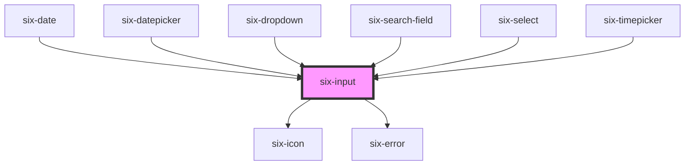

# six-input

Inputs collect data from the user.

<!-- EXAMPLES -->

<!-- Auto Generated Below -->

## Properties

| Property         | Attribute          | Description                                                                                                      | Type                                                                                               | Default     |
| ---------------- | ------------------ | ---------------------------------------------------------------------------------------------------------------- | -------------------------------------------------------------------------------------------------- | ----------- |
| `autocapitalize` | `autocapitalize`   | The input's autocaptialize attribute.                                                                            | `string`                                                                                           | `'off'`     |
| `autocomplete`   | `autocomplete`     | The input's autocomplete attribute.                                                                              | `string`                                                                                           | `'off'`     |
| `autocorrect`    | `autocorrect`      | The input's autocorrect attribute.                                                                               | `"off" \| "on"`                                                                                    | `'off'`     |
| `autofocus`      | `autofocus`        | The input's autofocus attribute.                                                                                 | `boolean`                                                                                          | `false`     |
| `clearable`      | `clearable`        | Set to true to add a clear button when the input is populated.                                                   | `boolean`                                                                                          | `false`     |
| `disabled`       | `disabled`         | Set to true to disable the input.                                                                                | `boolean`                                                                                          | `false`     |
| `dropdownSearch` | `dropdown-search`  | Internal: Styles the input for the dropdown filter search.                                                       | `boolean`                                                                                          | `false`     |
| `errorText`      | `error-text`       | The error message shown, if `invalid` is set to true.                                                            | `string \| string[]`                                                                               | `''`        |
| `errorTextCount` | `error-text-count` | The number of error texts to be shown (if the error-text slot isn't used). Defaults to 1                         | `number \| undefined`                                                                              | `undefined` |
| `helpText`       | `help-text`        | The input's help text. Alternatively, you can use the help-text slot.                                            | `string`                                                                                           | `''`        |
| `inputmode`      | `inputmode`        | The input's inputmode attribute.                                                                                 | `"decimal" \| "email" \| "none" \| "numeric" \| "search" \| "tel" \| "text" \| "url" \| undefined` | `undefined` |
| `invalid`        | `invalid`          | If this property is set to true and an error message is provided by `errorText`, the error message is displayed. | `boolean`                                                                                          | `false`     |
| `label`          | `label`            | The label text.                                                                                                  | `string`                                                                                           | `''`        |
| `line`           | `line`             | Set to render as line                                                                                            | `boolean`                                                                                          | `false`     |
| `max`            | `max`              | The input's maximum value.                                                                                       | `number \| undefined`                                                                              | `undefined` |
| `maxlength`      | `maxlength`        | The maximum length of input that will be considered valid.                                                       | `number \| undefined`                                                                              | `undefined` |
| `min`            | `min`              | The input's minimum value.                                                                                       | `number \| undefined`                                                                              | `undefined` |
| `minlength`      | `minlength`        | The minimum length of input that will be considered valid.                                                       | `number \| undefined`                                                                              | `undefined` |
| `name`           | `name`             | The input's name attribute.                                                                                      | `string`                                                                                           | `''`        |
| `pattern`        | `pattern`          | A pattern to validate input against.                                                                             | `string \| undefined`                                                                              | `undefined` |
| `pill`           | `pill`             | Set to true to draw a pill-style input with rounded edges.                                                       | `boolean`                                                                                          | `false`     |
| `placeholder`    | `placeholder`      | The input's placeholder text.                                                                                    | `string \| undefined`                                                                              | `undefined` |
| `readonly`       | `readonly`         | Set to true to make the input readonly.                                                                          | `boolean`                                                                                          | `false`     |
| `required`       | `required`         | Set to true to show an asterisk beneath the label.                                                               | `boolean`                                                                                          | `false`     |
| `size`           | `size`             | The input's size.                                                                                                | `"large" \| "medium" \| "small"`                                                                   | `'medium'`  |
| `spellcheck`     | `spellcheck`       | Enables spell checking on the input.                                                                             | `boolean`                                                                                          | `false`     |
| `step`           | `step`             | The input's step attribute.                                                                                      | `number \| undefined`                                                                              | `undefined` |
| `togglePassword` | `toggle-password`  | Set to true to add a password toggle button for password inputs.                                                 | `boolean`                                                                                          | `false`     |
| `type`           | `type`             | The input's type.                                                                                                | `"email" \| "number" \| "password" \| "search" \| "tel" \| "text" \| "url"`                        | `'text'`    |
| `value`          | `value`            | The input's value attribute.                                                                                     | `string`                                                                                           | `''`        |

## Events

| Event              | Description                                                                            | Type                     |
| ------------------ | -------------------------------------------------------------------------------------- | ------------------------ |
| `six-input-blur`   | Emitted when the control loses focus. Access the new value via event.target.value.     | `CustomEvent<undefined>` |
| `six-input-change` | Emitted when the control's value changes. Access the new value via event.target.value. | `CustomEvent<undefined>` |
| `six-input-clear`  | Emitted when the clear button is activated.                                            | `CustomEvent<undefined>` |
| `six-input-focus`  | Emitted when the control gains focus.                                                  | `CustomEvent<undefined>` |
| `six-input-input`  | Emitted when the control receives input. Access the new value via event.target.value.  | `CustomEvent<undefined>` |

## Methods

### `getSelectionRange() => Promise<SelectionRange>`

Returns the start and end positions of the text selection

#### Returns

Type: `Promise<SelectionRange>`

### `removeFocus() => Promise<void>`

Removes focus from the input.

#### Returns

Type: `Promise<void>`

### `select() => Promise<void | undefined>`

Selects all the text in the input.

#### Returns

Type: `Promise<void | undefined>`

### `setFocus(options?: FocusOptions) => Promise<void>`

Sets focus on the input.

#### Parameters

| Name      | Type                        | Description |
| --------- | --------------------------- | ----------- |
| `options` | `FocusOptions \| undefined` |             |

#### Returns

Type: `Promise<void>`

### `setRangeText(replacement: string, start: number, end: number, selectMode?: "select" | "start" | "end" | "preserve") => Promise<void>`

Replaces a range of text with a new string.

#### Parameters

| Name          | Type                                         | Description |
| ------------- | -------------------------------------------- | ----------- |
| `replacement` | `string`                                     |             |
| `start`       | `number`                                     |             |
| `end`         | `number`                                     |             |
| `selectMode`  | `"select" \| "start" \| "end" \| "preserve"` |             |

#### Returns

Type: `Promise<void>`

### `setSelectionRange(selectionStart: number, selectionEnd: number, selectionDirection?: SelectionRangeDirection) => Promise<void | undefined>`

Sets the start and end positions of the text selection (0-based).

#### Parameters

| Name                 | Type                                | Description |
| -------------------- | ----------------------------------- | ----------- |
| `selectionStart`     | `number`                            |             |
| `selectionEnd`       | `number`                            |             |
| `selectionDirection` | `"none" \| "forward" \| "backward"` |             |

#### Returns

Type: `Promise<void | undefined>`

## Slots

| Slot                   | Description                                                                                                 |
| ---------------------- | ----------------------------------------------------------------------------------------------------------- |
| `"clear-icon"`         | An icon to use in lieu of the default clear icon.                                                           |
| `"error-text"`         | Error text that is shown when the status is set to invalid. Alternatively, you can use the error-text prop. |
| `"help-text"`          | Help text that describes how to use the input. Alternatively, you can use the help-text prop.               |
| `"hide-password-icon"` | An icon to use in lieu of the default hide password icon.                                                   |
| `"label"`              | The input's label. Alternatively, you can use the label prop.                                               |
| `"prefix"`             | Used to prepend an icon or similar element to the input.                                                    |
| `"show-password-icon"` | An icon to use in lieu of the default show password icon.                                                   |
| `"suffix"`             | Used to append an icon or similar element to the input.                                                     |

## Shadow Parts

| Part                       | Description                                                             |
| -------------------------- | ----------------------------------------------------------------------- |
| `"base"`                   | The component's base wrapper.                                           |
| `"clear-button"`           | The clear button.                                                       |
| `"error-text"`             | The input error text.                                                   |
| `"form-control"`           | The form control that wraps the label, input, error-text and help-text. |
| `"help-text"`              | The input help text.                                                    |
| `"input"`                  | The input control.                                                      |
| `"label"`                  | The input label.                                                        |
| `"password-toggle-button"` | The password toggle button.                                             |
| `"prefix"`                 | The input prefix container.                                             |
| `"suffix"`                 | The input suffix container.                                             |

## Dependencies

### Used by

 - [six-date](../six-date)
 - [six-datepicker](../six-datepicker)
 - [six-dropdown](../six-dropdown)
 - [six-search-field](../six-search-field)
 - [six-select](../six-select)
 - [six-timepicker](../six-timepicker)

### Depends on

- [six-icon](../six-icon)
- [six-error](../six-error)

### Graph

----------------------------------------------

Copyright © 2021-present SIX-Group
