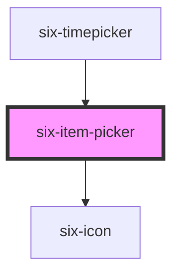

# six-item-picker

<!-- EXAMPLES -->

<!-- Auto Generated Below -->

## Properties

| Property           | Attribute           | Description                                                                                                                                                                                                                                                                                                                                                                            | Type                                                                                                                                      | Default                             |
| ------------------ | ------------------- | -------------------------------------------------------------------------------------------------------------------------------------------------------------------------------------------------------------------------------------------------------------------------------------------------------------------------------------------------------------------------------------- | ----------------------------------------------------------------------------------------------------------------------------------------- | ----------------------------------- |
| `debounce`         | `debounce`          | Set the amount of time, in milliseconds, to wait to trigger the `six-item-picker-change-debounced` event. If you want your change debounce event to not trigger when keeping the nav button pressed before, make sure debounce is a bit bigger than timeout, otherwise keeping the button pressed will trigger the event twice: once you click (and keep pressed) and once you release | `number`                                                                                                                                  | `DEFAULT_DEBOUNCE_FAST`             |
| `interval`         | `interval`          | Set the amount of time, in milliseconds, to wait between switching to next item when mouse button is held pressed.                                                                                                                                                                                                                                                                     | `number`                                                                                                                                  | `DEFAULT_DEBOUNCE_INSANELY_FAST`    |
| `items`            | --                  | Defines a custom list of items you can iterate through                                                                                                                                                                                                                                                                                                                                 | `string[]`                                                                                                                                | `undefined`                         |
| `max`              | `max`               | The maximum value allowed to pick.                                                                                                                                                                                                                                                                                                                                                     | `number \| string`                                                                                                                        | `undefined`                         |
| `min`              | `min`               | The minimum value allowed to pick.                                                                                                                                                                                                                                                                                                                                                     | `number \| string`                                                                                                                        | `undefined`                         |
| `padded`           | `padded`            | Defines whether the items should be padded                                                                                                                                                                                                                                                                                                                                             | `boolean`                                                                                                                                 | `false`                             |
| `paddingChar`      | `padding-char`      | Defines the character used for padding                                                                                                                                                                                                                                                                                                                                                 | `string`                                                                                                                                  | `'0'`                               |
| `paddingDirection` | `padding-direction` | Defines whether the padding should be before or after the value. You can either use 'before' or 'after'. By default before is selected                                                                                                                                                                                                                                                 | `ItemPickerPaddingDirection.AFTER \| ItemPickerPaddingDirection.BEFORE`                                                                   | `ItemPickerPaddingDirection.BEFORE` |
| `paddingLength`    | `padding-length`    | Defines the length of the padded area                                                                                                                                                                                                                                                                                                                                                  | `number`                                                                                                                                  | `2`                                 |
| `roundtrip`        | `roundtrip`         | Define whether the picker should to a roundtrip i.e. start at max when reaching min and vice versa.                                                                                                                                                                                                                                                                                    | `boolean`                                                                                                                                 | `true`                              |
| `step`             | `step`              | Defines how many steps should be taken when navigating                                                                                                                                                                                                                                                                                                                                 | `number`                                                                                                                                  | `1`                                 |
| `timeout`          | `timeout`           | Set the amount of time, in milliseconds, to wait to trigger faster switching between items.                                                                                                                                                                                                                                                                                            | `number`                                                                                                                                  | `DEFAULT_DEBOUNCE_FAST`             |
| `type`             | `type`              | The type of items you want to rotate through.                                                                                                                                                                                                                                                                                                                                          | `ItemPickerType.CAPITAL_LETTER \| ItemPickerType.CUSTOM \| ItemPickerType.LETTER \| ItemPickerType.LOWER_LETTER \| ItemPickerType.NUMBER` | `ItemPickerType.NUMBER`             |
| `value`            | `value`             | The item picker's value attribute.                                                                                                                                                                                                                                                                                                                                                     | `number \| string`                                                                                                                        | `''`                                |

## Events

| Event                              | Description                                                 | Type                                       |
| ---------------------------------- | ----------------------------------------------------------- | ------------------------------------------ |
| `six-item-picker-change`           | Emitted when the item picker's value changes                | `CustomEvent<boolean \| number \| string>` |
| `six-item-picker-change-debounced` | Emitted when the item picker's value changes, but debounced | `CustomEvent<boolean \| number \| string>` |

## Shadow Parts

| Part          | Description                   |
| ------------- | ----------------------------- |
| `"container"` | The whole component container |
| `"content"`   | The content area              |
| `"down"`      | The down button               |
| `"up"`        | The up button                 |

## Dependencies

### Used by

 - [six-timepicker](../six-timepicker)

### Depends on

- [six-icon](../six-icon)

### Graph

----------------------------------------------

Copyright © 2021-present SIX-Group
