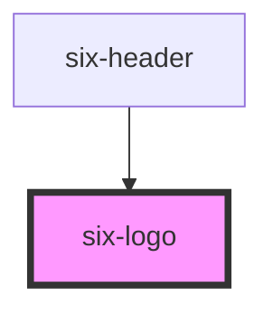

# six-header

<!-- EXAMPLES -->

<!-- Auto Generated Below -->

## Properties

| Property | Attribute | Description                                                | Type             | Default |
| -------- | --------- | ---------------------------------------------------------- | ---------------- | ------- |
| `brand`  | `brand`   | The brand of the logo. Either six or bme. Defaults to six. | `"bme" \| "six"` | `'six'` |

## CSS Custom Properties

| Name       | Description             |
| ---------- | ----------------------- |
| `--height` | The height of the logo. |

## Dependencies

### Used by

 - [six-header](../six-header)

### Graph

----------------------------------------------

Copyright © 2021-present SIX-Group
