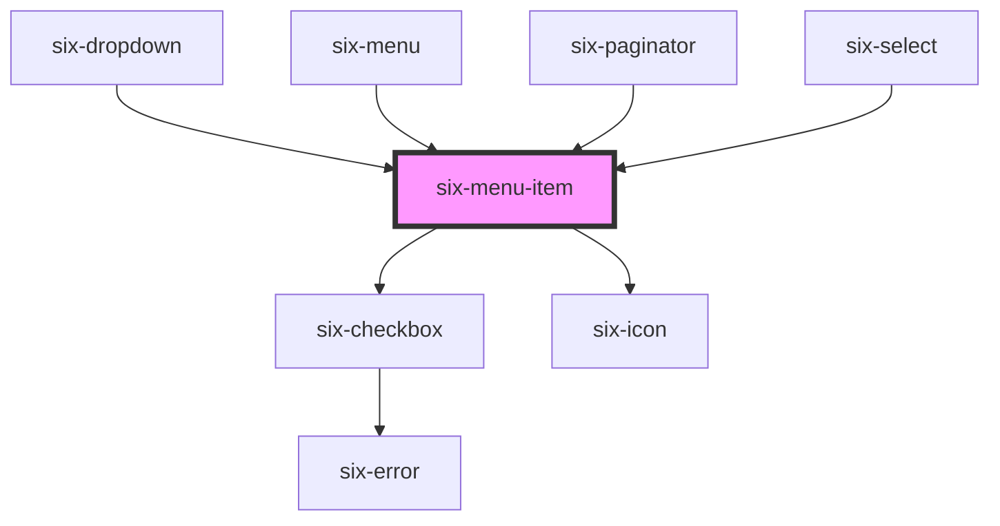

# six-menu-item

<!-- EXAMPLES -->

<!-- Auto Generated Below -->

## Properties

| Property    | Attribute    | Description                                                                                                               | Type                    | Default   |
| ----------- | ------------ | ------------------------------------------------------------------------------------------------------------------------- | ----------------------- | --------- |
| `checkType` | `check-type` | Defines if the checked state is displayed as a checkbox or a check-icon                                                   | `"check" \| "checkbox"` | `'check'` |
| `checked`   | `checked`    | Internal: Draws the item in a checked state. CheckType needs to be set to 'checkbox' or 'check' to show the checked state | `boolean`               | `false`   |
| `disabled`  | `disabled`   | Set to true to draw the menu item in a disabled state.                                                                    | `boolean`               | `false`   |
| `value`     | `value`      | A unique value to store in the menu item. This can be used as a way to identify menu items when selected.                 | `string`                | `''`      |

## Methods

### `getTextLabel() => Promise<string>`

Returns a text label based on the contents of the menu item's default slot.

#### Returns

Type: `Promise<string>`

### `removeFocus() => Promise<void>`

Removes focus from the button.

#### Returns

Type: `Promise<void>`

### `setFocus(options?: FocusOptions) => Promise<void>`

Sets focus on the button.

#### Parameters

| Name      | Type                        | Description |
| --------- | --------------------------- | ----------- |
| `options` | `FocusOptions \| undefined` |             |

#### Returns

Type: `Promise<void>`

## Slots

| Slot       | Description                                                  |
| ---------- | ------------------------------------------------------------ |
|            | The menu item's label.                                       |
| `"prefix"` | Used to prepend an icon or similar element to the menu item. |
| `"suffix"` | Used to append an icon or similar element to the menu item.  |

## Shadow Parts

| Part             | Description                                |
| ---------------- | ------------------------------------------ |
| `"base"`         | The component's base wrapper.              |
| `"checked-icon"` | The container that wraps the checked icon. |
| `"label"`        | The menu item label.                       |
| `"prefix"`       | The prefix container.                      |
| `"suffix"`       | The suffix container.                      |

## Dependencies

### Used by

 - [six-dropdown](../six-dropdown)
 - [six-menu](../six-menu)
 - [six-paginator](../six-paginator)
 - [six-select](../six-select)

### Depends on

- [six-checkbox](../six-checkbox)
- [six-icon](../six-icon)

### Graph

----------------------------------------------

Copyright © 2021-present SIX-Group
