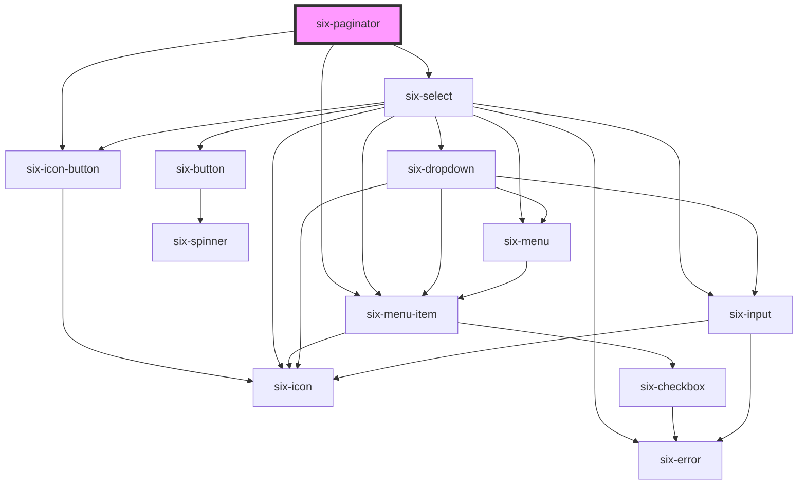

# six-paginator

<!-- EXAMPLES -->

<!-- Auto Generated Below -->

## Properties

| Property                    | Attribute          | Description                                                                                                                            | Type                  | Default        |
| --------------------------- | ------------------ | -------------------------------------------------------------------------------------------------------------------------------------- | --------------------- | -------------- |
| `clamp`                     | `clamp`            | Clamp the page numbers when they exceed the specified length.                                                                          | `boolean`             | `true`         |
| `currentPage`               | `current-page`     | The current page being displayed. This must be 0 based                                                                                 | `number \| undefined` | `undefined`    |
| `disabled`                  | `disabled`         | Disable all controls.                                                                                                                  | `boolean`             | `false`        |
| `length`                    | `length`           | The amount of clickable page numbers to show.                                                                                          | `number`              | `9`            |
| `resultsPerPage`            | `results-per-page` | The results per page. Value must be one provided in the resultsPerPageOption. Otherwise the first value from the options will be used. | `number \| undefined` | `undefined`    |
| `resultsPerPageOptions`     | --                 | The possible results per page. Must be a list of integers. At least one value is required.                                             | `number[]`            | `[12, 24, 48]` |
| `totalPages` _(required)_   | `total-pages`      | The total amount of pages.                                                                                                             | `number`              | `undefined`    |
| `totalResults` _(required)_ | `total-results`    | The total amount of results.                                                                                                           | `number`              | `undefined`    |

## Events

| Event                                    | Description                                                                                                                         | Type                                                    |
| ---------------------------------------- | ----------------------------------------------------------------------------------------------------------------------------------- | ------------------------------------------------------- |
| `six-paginator-page-changed`             | Emitted whenever the page changes. This can be either due to one of the arrows bein pressed, or an explicit click on a page number. | `CustomEvent<SixPaginatorPageChangedPayload>`           |
| `six-paginator-results-per-page-changed` | Emitted after the user selects a value from the results per page select.                                                            | `CustomEvent<SixPaginatorResultsPerPageChangedPayload>` |

## Dependencies

### Depends on

- [six-icon-button](../six-icon-button)
- [six-select](../six-select)
- [six-menu-item](../six-menu-item)

### Graph

----------------------------------------------

Copyright © 2021-present SIX-Group
