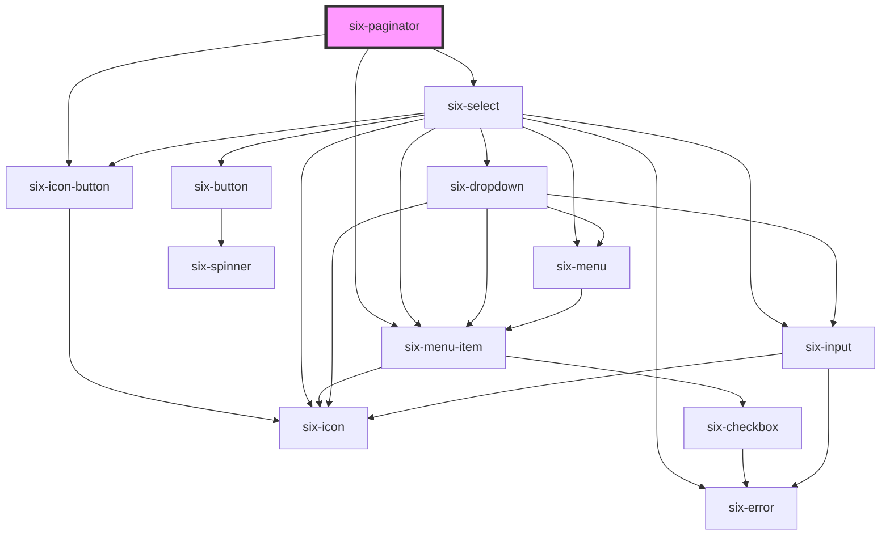

# six-paginator

<!-- Auto Generated Below -->

## Properties

| Property         | Attribute      | Description                                                                                | Type       | Default        |
| ---------------- | -------------- | ------------------------------------------------------------------------------------------ | ---------- | -------------- |
| `currentPage`    | `current-page` | current page                                                                               | `number`   | `0`            |
| `resultsPerPage` | --             | The possible results per page. Must be a list of integers. At least one value is required! | `number[]` | `[12, 24, 48]` |
| `totalPages`     | `total-pages`  | The total amount of pages                                                                  | `number`   | `20`           |

## Events

| Event                                    | Description                                                                                                                                                   | Type                                        |
| ---------------------------------------- | ------------------------------------------------------------------------------------------------------------------------------------------------------------- | ------------------------------------------- |
| `six-paginator-page-changed`             | Emitted either when the user explicitly clicks on a number, or when a back/forward button is pressed. The page number emitted is an index which is zero-based | `CustomEvent<PageChangedPayload>`           |
| `six-paginator-results-per-page-changed` | Emitted after the user selects a value from the results per page select.                                                                                      | `CustomEvent<ResultsPerPageChangedPayload>` |

## Dependencies

### Depends on

- [six-icon-button](../six-icon-button)
- [six-select](../six-select)
- [six-menu-item](../six-menu-item)

### Graph

----------------------------------------------

Copyright © 2021-present SIX-Group
