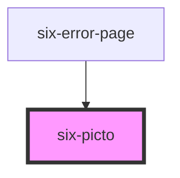

# six-picto

<!-- EXAMPLES -->

<!-- Auto Generated Below -->

## Properties

| Property | Attribute | Description                   | Type                                                                                         | Default    |
| -------- | --------- | ----------------------------- | -------------------------------------------------------------------------------------------- | ---------- |
| `size`   | `size`    | Defines the size of the icon. | `"4xl" \| "large" \| "medium" \| "small" \| "xLarge" \| "xSmall" \| "xxLarge" \| "xxxLarge"` | `'medium'` |

## Shadow Parts

| Part     | Description                   |
| -------- | ----------------------------- |
| `"icon"` | The component's icon wrapper. |

## Dependencies

### Used by

 - [six-error-page](../six-error-page)

### Graph

----------------------------------------------

Copyright © 2021-present SIX-Group
