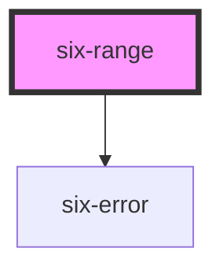

# six-range

<!-- EXAMPLES -->

<!-- Auto Generated Below -->

## Properties

| Property           | Attribute          | Description                                                                                                      | Type                          | Default                               |
| ------------------ | ------------------ | ---------------------------------------------------------------------------------------------------------------- | ----------------------------- | ------------------------------------- |
| `disabled`         | `disabled`         | Set to true to disable the input.                                                                                | `boolean`                     | `false`                               |
| `errorText`        | `error-text`       | The error message shown, if `invalid` is set to true.                                                            | `string \| string[]`          | `''`                                  |
| `errorTextCount`   | `error-text-count` | The number of error texts to be shown (if the error-text slot isn't used). Defaults to 1                         | `number \| undefined`         | `undefined`                           |
| `helpText`         | `help-text`        | The range's help text. Alternatively, you can use the help-text slot.                                            | `string`                      | `''`                                  |
| `invalid`          | `invalid`          | If this property is set to true and an error message is provided by `errorText`, the error message is displayed. | `boolean`                     | `false`                               |
| `label`            | `label`            | The label text.                                                                                                  | `string`                      | `''`                                  |
| `max`              | `max`              | The input's max attribute.                                                                                       | `number`                      | `100`                                 |
| `min`              | `min`              | The input's min attribute.                                                                                       | `number`                      | `0`                                   |
| `name`             | `name`             | The input's name attribute.                                                                                      | `string`                      | `''`                                  |
| `required`         | `required`         | Set to true to show an asterisk beneath the label.                                                               | `boolean`                     | `false`                               |
| `step`             | `step`             | The input's step attribute.                                                                                      | `number`                      | `1`                                   |
| `tooltip`          | `tooltip`          | The preferred placedment of the tooltip.                                                                         | `"bottom" \| "none" \| "top"` | `'top'`                               |
| `tooltipFormatter` | --                 | A function used to format the tooltip's value.                                                                   | `(value: number) => string`   | `(value: number) => value.toString()` |
| `value`            | `value`            | The input's value attribute.                                                                                     | `number`                      | `0`                                   |

## Events

| Event              | Description                               | Type                     |
| ------------------ | ----------------------------------------- | ------------------------ |
| `six-range-blur`   | Emitted when the control loses focus.     | `CustomEvent<undefined>` |
| `six-range-change` | Emitted when the control's value changes. | `CustomEvent<undefined>` |
| `six-range-focus`  | Emitted when the control gains focus.     | `CustomEvent<undefined>` |

## Methods

### `removeFocus() => Promise<void>`

Removes focus from the input.

#### Returns

Type: `Promise<void>`

### `setFocus(options?: FocusOptions) => Promise<void>`

Sets focus on the input.

#### Parameters

| Name      | Type                        | Description |
| --------- | --------------------------- | ----------- |
| `options` | `FocusOptions \| undefined` |             |

#### Returns

Type: `Promise<void>`

## Slots

| Slot           | Description                                                                                     |
| -------------- | ----------------------------------------------------------------------------------------------- |
| `"error-text"` | Error text that is shown for validation errors. Alternatively, you can use the error-text prop. |
| `"help-text"`  | Help text that describes how to use the input. Alternatively, you can use the help-text prop.   |
| `"label"`      | The input's label. Alternatively, you can use the label prop.                                   |

## Shadow Parts

| Part        | Description                   |
| ----------- | ----------------------------- |
| `"base"`    | The component's base wrapper. |
| `"input"`   | The native range input.       |
| `"tooltip"` | The range tooltip.            |

## Dependencies

### Depends on

- [six-error](../six-error)

### Graph

----------------------------------------------

Copyright © 2021-present SIX-Group
