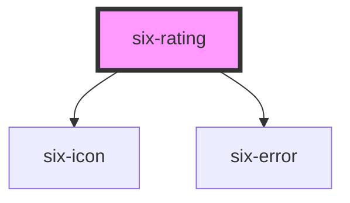

# six-rating

<!-- EXAMPLES -->

<!-- Auto Generated Below -->

## Properties

| Property         | Attribute          | Description                                                                                                      | Type                                                                                | Default     |
| ---------------- | ------------------ | ---------------------------------------------------------------------------------------------------------------- | ----------------------------------------------------------------------------------- | ----------- |
| `disabled`       | `disabled`         | Set to true to disable the rating.                                                                               | `boolean`                                                                           | `false`     |
| `errorText`      | `error-text`       | The error message shown, if `invalid` is set to true.                                                            | `string \| string[]`                                                                | `''`        |
| `errorTextCount` | `error-text-count` | The number of error texts to be shown (if the error-text slot isn't used). Defaults to 1                         | `number \| undefined`                                                               | `undefined` |
| `invalid`        | `invalid`          | If this property is set to true and an error message is provided by `errorText`, the error message is displayed. | `boolean`                                                                           | `false`     |
| `label`          | `label`            | The label text.                                                                                                  | `string`                                                                            | `''`        |
| `max`            | `max`              | Maximum number of stars. Default is 5                                                                            | `number`                                                                            | `5`         |
| `name`           | `name`             | The rating's name attribute.                                                                                     | `string`                                                                            | `''`        |
| `readonly`       | `readonly`         | If its readonly                                                                                                  | `boolean`                                                                           | `false`     |
| `required`       | `required`         | Set to true to show an asterisk beneath the label.                                                               | `boolean`                                                                           | `false`     |
| `size`           | `size`             | Size of the stars                                                                                                | `"large" \| "medium" \| "small" \| "xLarge" \| "xSmall" \| "xxLarge" \| "xxxLarge"` | `'medium'`  |
| `value`          | `value`            | The rating's value attribute.                                                                                    | `number`                                                                            | `0`         |

## Events

| Event               | Description                                       | Type                     |
| ------------------- | ------------------------------------------------- | ------------------------ |
| `six-rating-blur`   | Emitted when the control loses focus.             | `CustomEvent<number>`    |
| `six-rating-change` | Emitted when the control's checked state changes. | `CustomEvent<number>`    |
| `six-rating-focus`  | Emitted when the control gains focus.             | `CustomEvent<undefined>` |

## Shadow Parts

| Part      | Description |
| --------- | ----------- |
| `"base"`  |             |
| `"input"` |             |

## Dependencies

### Depends on

- [six-icon](../six-icon)
- [six-error](../six-error)

### Graph

----------------------------------------------

Copyright © 2021-present SIX-Group
