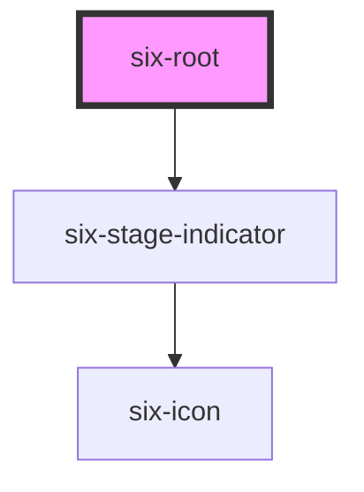

# six-root

Six root gives you a [basic layout](<https://en.wikipedia.org/wiki/Holy_grail_(web_design)>) skeleton and manages the application theme.

<!-- EXAMPLES -->

<!-- Auto Generated Below -->

## Properties

| Property  | Attribute | Description                                          | Type                                                        | Default   |
| --------- | --------- | ---------------------------------------------------- | ----------------------------------------------------------- | --------- |
| `padded`  | `padded`  | Defines whether the content section should be padded | `boolean`                                                   | `true`    |
| `stage`   | `stage`   | Defines the stage of the application                 | `"ACCEPTANCE" \| "DEV" \| "ETU" \| "ITU" \| "PROD" \| null` | `null`    |
| `theme`   | `theme`   | Defines the theme                                    | `"auto" \| "dark" \| "light"`                               | `'light'` |
| `version` | `version` | Defines the version of the application               | `string`                                                    | `''`      |

## Methods

### `getTheme() => Promise<{ theme: SixTheme; appliedTheme: "light" | "dark"; }>`

Gets the current theme and applied theme.

#### Returns

Type: `Promise<{ theme: SixTheme; appliedTheme: "light" | "dark"; }>`

### `setTheme(theme: SixTheme) => Promise<void>`

Sets the theme.

#### Parameters

| Name    | Type                          | Description |
| ------- | ----------------------------- | ----------- |
| `theme` | `"auto" \| "light" \| "dark"` |             |

#### Returns

Type: `Promise<void>`

### `toggleTheme() => Promise<void>`

Toggles between light and dark theme.

#### Returns

Type: `Promise<void>`

## Slots

| Slot              | Description                                     |
| ----------------- | ----------------------------------------------- |
| `"footer"`        | Used to define the footer component.            |
| `"header"`        | Used to define the header component.            |
| `"left-sidebar"`  | Used to define the sidebar on the left side.    |
| `"main"`          | Used to define the components in the main area. |
| `"right-sidebar"` | Used to define the sidebar on the right side.   |

## Shadow Parts

| Part              | Description |
| ----------------- | ----------- |
| `"container"`     |             |
| `"header"`        |             |
| `"left-sidebar"`  |             |
| `"main"`          |             |
| `"right-sidebar"` |             |

## Dependencies

### Depends on

- [six-stage-indicator](../six-stage-indicator)

### Graph

----------------------------------------------

Copyright © 2021-present SIX-Group
