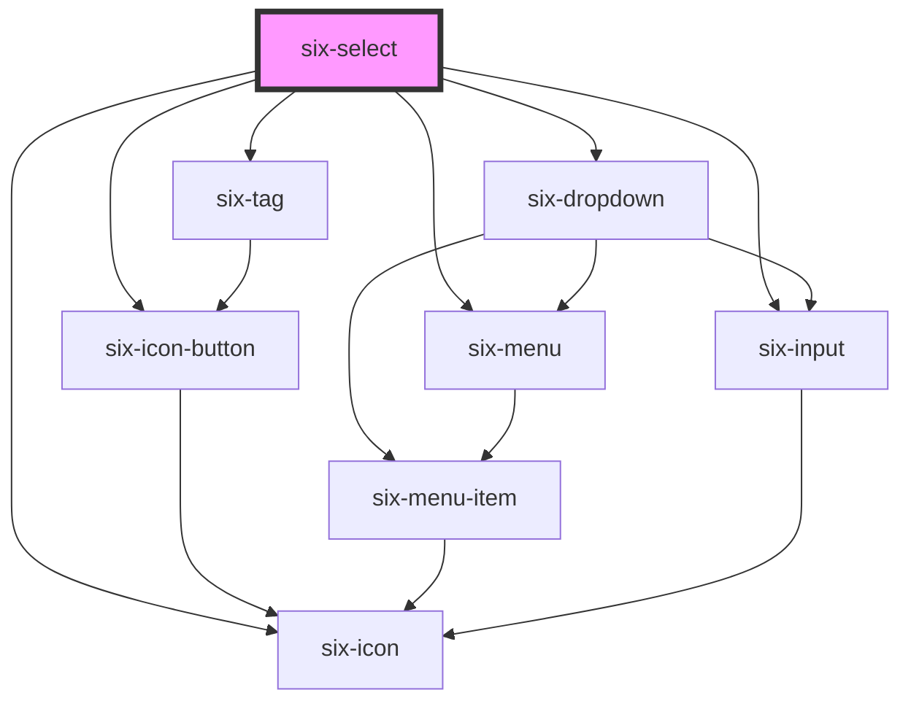

# six-select

<!-- EXAMPLES -->

<!-- Auto Generated Below -->

## Properties

| Property            | Attribute            | Description                                                                                                                                                                                                                                                           | Type                             | Default                 |
| ------------------- | -------------------- | --------------------------------------------------------------------------------------------------------------------------------------------------------------------------------------------------------------------------------------------------------------------- | -------------------------------- | ----------------------- |
| `asyncFilter`       | `async-filter`       | Set to true to allow async filtering. When you enter something in the search field the component will only emit an event but not filter any elements itself. You can then simply listen to the 'six-async-filter-fired' event to manage the shown menu-items yourself | `boolean`                        | `false`                 |
| `autocomplete`      | `autocomplete`       | Set to true to turn the six-select into an autocomplete.                                                                                                                                                                                                              | `boolean`                        | `false`                 |
| `clearable`         | `clearable`          | Set to true to add a clear button when the select is populated.                                                                                                                                                                                                       | `boolean`                        | `false`                 |
| `defaultValue`      | `default-value`      | The default value the select will be reverted to when reset is executed                                                                                                                                                                                               | `string \| string[]`             | `undefined`             |
| `disabled`          | `disabled`           | Set to true to disable the select control.                                                                                                                                                                                                                            | `boolean`                        | `false`                 |
| `errorOnBlur`       | `error-on-blur`      | Set to display the error text on blur and not when typing                                                                                                                                                                                                             | `boolean`                        | `false`                 |
| `errorText`         | `error-text`         | The select's error text. Alternatively, you can use the error-text slot.                                                                                                                                                                                              | `string`                         | `''`                    |
| `filter`            | `filter`             | Set to true to allow filtering for entries in the dropdown                                                                                                                                                                                                            | `boolean`                        | `false`                 |
| `filterDebounce`    | `filter-debounce`    | The debounce for the filter callbacks.                                                                                                                                                                                                                                | `number`                         | `DEFAULT_DEBOUNCE_FAST` |
| `filterPlaceholder` | `filter-placeholder` | The filter's placeholder text.                                                                                                                                                                                                                                        | `string`                         | `undefined`             |
| `helpText`          | `help-text`          | The select's help text. Alternatively, you can use the help-text slot.                                                                                                                                                                                                | `string`                         | `''`                    |
| `hoist`             | `hoist`              | Enable this option to prevent the panel from being clipped when the component is placed inside a container with `overflow: auto\|scroll`.                                                                                                                             | `boolean`                        | `false`                 |
| `inputDebounce`     | `input-debounce`     | The debounce for when the input changes for autocompletes should be emitted                                                                                                                                                                                           | `number`                         | `DEFAULT_DEBOUNCE_FAST` |
| `invalid`           | `invalid`            | This will be true when the control is in an invalid state. Validity is determined by the `required` prop.                                                                                                                                                             | `boolean`                        | `false`                 |
| `label`             | `label`              | The select's label. Alternatively, you can use the label slot.                                                                                                                                                                                                        | `string`                         | `''`                    |
| `line`              | `line`               | Set to render as line                                                                                                                                                                                                                                                 | `boolean`                        | `false`                 |
| `maxTagsVisible`    | `max-tags-visible`   | The maximum number of tags to show when `multiple` is true. After the maximum, "+n" will be shown to indicate the number of additional items that are selected. Set to -1 to remove the limit.                                                                        | `number`                         | `3`                     |
| `multiple`          | `multiple`           | Set to true to enable multiselect.                                                                                                                                                                                                                                    | `boolean`                        | `false`                 |
| `name`              | `name`               | The select's name.                                                                                                                                                                                                                                                    | `string`                         | `''`                    |
| `options`           | --                   | Set the options to be shown in the dropdown (alternative to setting the elements via html)                                                                                                                                                                            | `SixMenuItemData[]`              | `null`                  |
| `pill`              | `pill`               | Set to true to draw a pill-style select with rounded edges.                                                                                                                                                                                                           | `boolean`                        | `false`                 |
| `placeholder`       | `placeholder`        | The select's placeholder text.                                                                                                                                                                                                                                        | `string`                         | `''`                    |
| `required`          | `required`           | The select's required attribute.                                                                                                                                                                                                                                      | `boolean`                        | `false`                 |
| `size`              | `size`               | The select's size.                                                                                                                                                                                                                                                    | `"large" \| "medium" \| "small"` | `'medium'`              |
| `value`             | `value`              | The value of the control. This will be a string or an array depending on `multiple`.                                                                                                                                                                                  | `string \| string[]`             | `''`                    |
| `virtualScroll`     | `virtual-scroll`     | Defines whether the menu list will be rendered virtually i.e. only the elements actually shown (and a couple around) are actually rendered in the DOM. If you use virtual scrolling pass the elements via prop instead of via slot.                                   | `boolean`                        | `false`                 |

## Events

| Event               | Description                               | Type                                  |
| ------------------- | ----------------------------------------- | ------------------------------------- |
| `six-select-blur`   | Emitted when the control loses focus.     | `CustomEvent<undefined>`              |
| `six-select-change` | Emitted when the control's value changes. | `CustomEvent<SixSelectChangePayload>` |
| `six-select-focus`  | Emitted when the control gains focus.     | `CustomEvent<undefined>`              |

## Methods

### `checkValidity() => Promise<boolean>`

Checks for validity.

#### Returns

Type: `Promise<boolean>`

### `reportValidity() => Promise<boolean>`

Checks for validity and shows the browser's validation message if the control is invalid.

#### Returns

Type: `Promise<boolean>`

### `reset() => Promise<void>`

Resets the formcontrol

#### Returns

Type: `Promise<void>`

### `setCustomValidity(message: string) => Promise<void>`

Sets a custom validation message. If `message` is not empty, the field will be considered invalid.

#### Returns

Type: `Promise<void>`

## Slots

| Slot           | Description                                                                                     |
| -------------- | ----------------------------------------------------------------------------------------------- |
|                | The select's options in the form of menu items.                                                 |
| `"error-text"` | Error text that is shown for validation errors. Alternatively, you can use the error-text prop. |
| `"help-text"`  | Help text that describes how to use the select.                                                 |
| `"label"`      | The select's label. Alternatively, you can use the label prop.                                  |

## Shadow Parts

| Part             | Description                                                  |
| ---------------- | ------------------------------------------------------------ |
| `"base"`         | The component's base wrapper.                                |
| `"clear-button"` | The input's clear button, exported from six-input.           |
| `"form-control"` | The form control that wraps the label, input, and help text. |
| `"help-text"`    | The select's help text.                                      |
| `"icon"`         | The select's icon.                                           |
| `"label"`        | The select's label.                                          |
| `"menu"`         | The select menu, a six-menu element.                         |
| `"tag"`          | The multiselect option, a six-tag element.                   |
| `"tags"`         | The container in which multiselect options are rendered.     |

## Dependencies

### Depends on

- [six-tag](../six-tag)
- [six-dropdown](../six-dropdown)
- [six-icon-button](../six-icon-button)
- [six-icon](../six-icon)
- [six-input](../six-input)
- [six-menu](../six-menu)

### Graph

----------------------------------------------

Copyright © 2021-present SIX-Group
