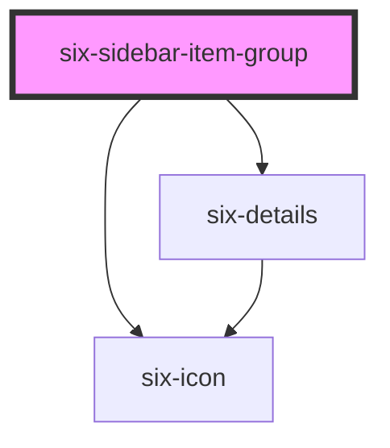

# six-sidebar-item-group

<!-- EXAMPLES -->

<!-- Auto Generated Below -->

## Properties

| Property      | Attribute      | Description                                                                                                                        | Type                  | Default     |
| ------------- | -------------- | ---------------------------------------------------------------------------------------------------------------------------------- | --------------------- | ----------- |
| `href`        | `href`         | Provide if the item should be rendered as anchor tag. Note, that the href is added automatically when using routerLink in Angular. | `string \| undefined` | `undefined` |
| `icon`        | `icon`         | Icon of the group                                                                                                                  | `string`              | `''`        |
| `name`        | `name`         | Title of item group                                                                                                                | `string`              | `''`        |
| `open`        | `open`         | Indicates whether the sidebar is shown                                                                                             | `boolean`             | `false`     |
| `summaryIcon` | `summary-icon` | Custom summary icon name.                                                                                                          | `string \| undefined` | `undefined` |
| `value`       | `value`        | A unique value to store in the sidebar item of the group label. This can be used as a way to identify sidebar items when selected. | `string`              | `''`        |

## Slots

| Slot | Description                                      |
| ---- | ------------------------------------------------ |
|      | Used to define the nested sidebar [group] items. |

## Dependencies

### Depends on

- [six-details](../six-details)
- [six-icon](../six-icon)

### Graph

----------------------------------------------

Copyright © 2021-present SIX-Group
