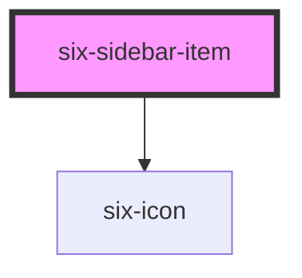

# six-sidebar-item

<!-- EXAMPLES -->

<!-- Auto Generated Below -->

## Properties

| Property   | Attribute  | Description                                                                                                                        | Type                  | Default     |
| ---------- | ---------- | ---------------------------------------------------------------------------------------------------------------------------------- | --------------------- | ----------- |
| `disabled` | `disabled` | Set to true to draw the sidebar item in a disabled state.                                                                          | `boolean`             | `false`     |
| `href`     | `href`     | Provide if the item should be rendered as anchor tag. Note, that the href is added automatically when using routerLink in Angular. | `string \| undefined` | `undefined` |
| `icon`     | `icon`     | Icon of the item                                                                                                                   | `string`              | `''`        |
| `selected` | `selected` | Set to true to draw the item in a selected state.                                                                                  | `boolean`             | `false`     |
| `value`    | `value`    | A unique value to store in the sidebar item. This can be used as a way to identify sidebar items when selected.                    | `string`              | `''`        |

## Slots

| Slot | Description                                           |
| ---- | ----------------------------------------------------- |
|      | Used to define the nested displayed text of the item. |

## Dependencies

### Depends on

- [six-icon](../six-icon)

### Graph

----------------------------------------------

Copyright © 2021-present SIX-Group
