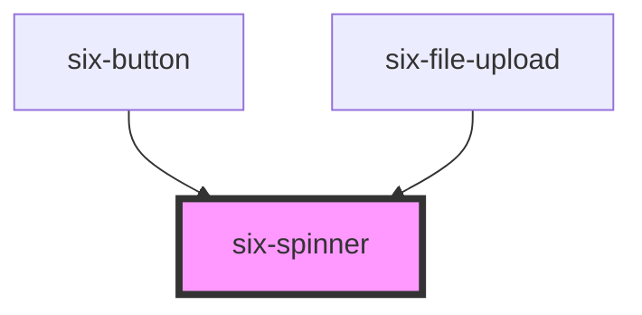

# six-spinner

<!-- EXAMPLES -->

<!-- Auto Generated Below -->

## Properties

| Property | Attribute | Description                                                                                   | Type                          | Default     |
| -------- | --------- | --------------------------------------------------------------------------------------------- | ----------------------------- | ----------- |
| `logo`   | `logo`    | Indicates if the spinner is shown as animated SIX or BME logo or a simple spinner.            | `"bme" \| "six" \| undefined` | `undefined` |
| `six`    | `six`     | **@deprecated** Use `logo="six"` instead.  If set to true, the spinner displays the SIX logo. | `boolean \| undefined`        | `undefined` |

## Shadow Parts

| Part     | Description                   |
| -------- | ----------------------------- |
| `"base"` | The component's base wrapper. |
| `"svg"`  | The spinner icon.             |

## CSS Custom Properties

| Name                | Description                           |
| ------------------- | ------------------------------------- |
| `--indicator-color` | The color of the spinner's indicator. |
| `--stroke-width`    | The width of the indicator.           |
| `--track-color`     | The color of the spinner's track.     |

## Dependencies

### Used by

 - [six-button](../six-button)
 - [six-file-upload](../six-file-upload)

### Graph

----------------------------------------------

Copyright © 2021-present SIX-Group
