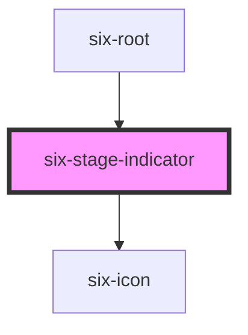

# six-stage-indicator

<!-- EXAMPLES -->

<!-- Auto Generated Below -->

## Properties

| Property | Attribute | Description                    | Type                                                                   | Default |
| -------- | --------- | ------------------------------ | ---------------------------------------------------------------------- | ------- |
| `stage`  | `stage`   | The indicators value attribute | `"ACCEPTANCE" \| "DEV" \| "ETU" \| "ITU" \| "LOCAL" \| "PROD" \| null` | `null`  |

## Dependencies

### Used by

 - [six-root](../six-root)

### Depends on

- [six-icon](../six-icon)

### Graph

----------------------------------------------

Copyright © 2021-present SIX-Group
