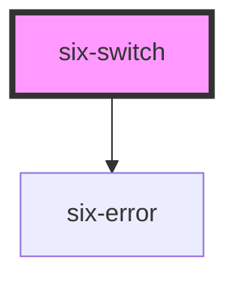

# six-switch

<!-- EXAMPLES -->

<!-- Auto Generated Below -->

## Properties

| Property         | Attribute          | Description                                                                                                      | Type                  | Default     |
| ---------------- | ------------------ | ---------------------------------------------------------------------------------------------------------------- | --------------------- | ----------- |
| `checked`        | `checked`          | Set to true to draw the switch in a checked state.                                                               | `boolean`             | `false`     |
| `disabled`       | `disabled`         | Set to true to disable the switch.                                                                               | `boolean`             | `false`     |
| `errorText`      | `error-text`       | The error message shown, if `invalid` is set to true.                                                            | `string \| string[]`  | `''`        |
| `errorTextCount` | `error-text-count` | The number of error texts to be shown (if the error-text slot isn't used). Defaults to 1                         | `number \| undefined` | `undefined` |
| `invalid`        | `invalid`          | If this property is set to true and an error message is provided by `errorText`, the error message is displayed. | `boolean`             | `false`     |
| `label`          | `label`            | The label text.                                                                                                  | `string`              | `''`        |
| `name`           | `name`             | The switch's name attribute.                                                                                     | `string`              | `''`        |
| `required`       | `required`         | Set to true to show an asterisk beneath the label.                                                               | `boolean`             | `false`     |
| `value`          | `value`            | The switch's value attribute.                                                                                    | `string`              | `'on'`      |

## Events

| Event               | Description                                       | Type                     |
| ------------------- | ------------------------------------------------- | ------------------------ |
| `six-switch-blur`   | Emitted when the control loses focus.             | `CustomEvent<boolean>`   |
| `six-switch-change` | Emitted when the control's checked state changes. | `CustomEvent<boolean>`   |
| `six-switch-focus`  | Emitted when the control gains focus.             | `CustomEvent<undefined>` |

## Methods

### `removeFocus() => Promise<void>`

Removes focus from the switch.

#### Returns

Type: `Promise<void>`

### `setFocus(options?: FocusOptions) => Promise<void>`

Sets focus on the switch.

#### Returns

Type: `Promise<void>`

## Slots

| Slot           | Description                                                                                     |
| -------------- | ----------------------------------------------------------------------------------------------- |
|                | The switch's label.                                                                             |
| `"error-text"` | Error text that is shown for validation errors. Alternatively, you can use the error-text prop. |

## Shadow Parts

| Part        | Description                    |
| ----------- | ------------------------------ |
| `"base"`    | The component's base wrapper.  |
| `"control"` | The switch control.            |
| `"label"`   | The switch label.              |
| `"thumb"`   | The switch position indicator. |

## CSS Custom Properties

| Name           | Description               |
| -------------- | ------------------------- |
| `--height`     | The height of the switch. |
| `--thumb-size` | The size of the thumb.    |
| `--width`      | The width of the switch.  |

## Dependencies

### Depends on

- [six-error](../six-error)

### Graph

----------------------------------------------

Copyright © 2021-present SIX-Group
