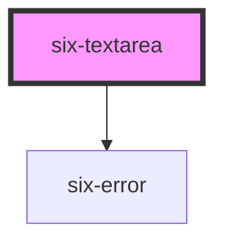

# six-textarea

<!-- EXAMPLES -->

<!-- Auto Generated Below -->

## Properties

| Property         | Attribute          | Description                                                                                                      | Type                                                                                               | Default      |
| ---------------- | ------------------ | ---------------------------------------------------------------------------------------------------------------- | -------------------------------------------------------------------------------------------------- | ------------ |
| `autocapitalize` | `autocapitalize`   | The textarea's autocaptialize attribute.                                                                         | `string`                                                                                           | `'off'`      |
| `autocomplete`   | `autocomplete`     | The textarea's autocomplete attribute.                                                                           | `string`                                                                                           | `'off'`      |
| `autocorrect`    | `autocorrect`      | The textarea's autocorrect attribute.                                                                            | `"off" \| "on"`                                                                                    | `'off'`      |
| `autofocus`      | `autofocus`        | The textarea's autofocus attribute.                                                                              | `boolean`                                                                                          | `false`      |
| `disabled`       | `disabled`         | Set to true to disable the textarea.                                                                             | `boolean`                                                                                          | `false`      |
| `errorText`      | `error-text`       | The error message shown, if `invalid` is set to true.                                                            | `string \| string[]`                                                                               | `''`         |
| `errorTextCount` | `error-text-count` | The number of error texts to be shown (if the error-text slot isn't used). Defaults to 1                         | `number \| undefined`                                                                              | `undefined`  |
| `helpText`       | `help-text`        | The textarea's help text. Alternatively, you can use the help-text slot.                                         | `string`                                                                                           | `''`         |
| `inputmode`      | `inputmode`        | The textarea's inputmode attribute.                                                                              | `"decimal" \| "email" \| "none" \| "numeric" \| "search" \| "tel" \| "text" \| "url" \| undefined` | `undefined`  |
| `invalid`        | `invalid`          | If this property is set to true and an error message is provided by `errorText`, the error message is displayed. | `boolean`                                                                                          | `false`      |
| `label`          | `label`            | The label text.                                                                                                  | `string`                                                                                           | `''`         |
| `maxlength`      | `maxlength`        | The maximum length of input that will be considered valid.                                                       | `number \| undefined`                                                                              | `undefined`  |
| `minlength`      | `minlength`        | The minimum length of input that will be considered valid.                                                       | `number \| undefined`                                                                              | `undefined`  |
| `name`           | `name`             | The textarea's name attribute.                                                                                   | `string`                                                                                           | `''`         |
| `placeholder`    | `placeholder`      | The textarea's placeholder text.                                                                                 | `string \| undefined`                                                                              | `undefined`  |
| `readonly`       | `readonly`         | Set to true for a readonly textarea.                                                                             | `boolean`                                                                                          | `false`      |
| `required`       | `required`         | Set to true to show an asterisk beneath the label.                                                               | `boolean`                                                                                          | `false`      |
| `resize`         | `resize`           | Controls how the textarea can be resized.                                                                        | `"auto" \| "none" \| "vertical"`                                                                   | `'vertical'` |
| `rows`           | `rows`             | The number of rows to display by default.                                                                        | `number`                                                                                           | `4`          |
| `size`           | `size`             | The textarea's size.                                                                                             | `"large" \| "medium" \| "small"`                                                                   | `'medium'`   |
| `spellcheck`     | `spellcheck`       | The textarea's spellcheck attribute.                                                                             | `boolean`                                                                                          | `false`      |
| `textStyle`      | `text-style`       | The textarea's textStyle attribute.                                                                              | `"code" \| "plain" \| undefined`                                                                   | `undefined`  |
| `value`          | `value`            | The textarea's value attribute.                                                                                  | `string`                                                                                           | `''`         |

## Events

| Event                 | Description                                                                            | Type                     |
| --------------------- | -------------------------------------------------------------------------------------- | ------------------------ |
| `six-textarea-blur`   | Emitted when the control loses focus. Access the new value via event.target.value.     | `CustomEvent<undefined>` |
| `six-textarea-change` | Emitted when the control's value changes. Access the new value via event.target.value. | `CustomEvent<undefined>` |
| `six-textarea-focus`  | Emitted when the control gains focus.                                                  | `CustomEvent<undefined>` |
| `six-textarea-input`  | Emitted when the control receives input. Access the new value via event.target.value.  | `CustomEvent<undefined>` |

## Methods

### `removeFocus() => Promise<void>`

Removes focus fromt the textarea.

#### Returns

Type: `Promise<void>`

### `select() => Promise<void | undefined>`

Selects all the text in the input.

#### Returns

Type: `Promise<void | undefined>`

### `setFocus(options?: FocusOptions) => Promise<void>`

Sets focus on the textarea.

#### Returns

Type: `Promise<void>`

### `setRangeText(replacement: string, start: number, end: number, selectMode?: 'select' | 'start' | 'end' | 'preserve') => Promise<void>`

Replaces a range of text with a new string.

#### Returns

Type: `Promise<void>`

### `setSelectionRange(selectionStart: number, selectionEnd: number, selectionDirection?: 'forward' | 'backward' | 'none') => Promise<void | undefined>`

Sets the start and end positions of the text selection (0-based).

#### Returns

Type: `Promise<void | undefined>`

## Slots

| Slot           | Description                                                                                     |
| -------------- | ----------------------------------------------------------------------------------------------- |
| `"error-text"` | Error text that is shown for validation errors. Alternatively, you can use the error-text prop. |
| `"help-text"`  | Help text that describes how to use the input.                                                  |
| `"label"`      | The textarea's label. Alternatively, you can use the label prop.                                |

## Shadow Parts

| Part             | Description                                                     |
| ---------------- | --------------------------------------------------------------- |
| `"base"`         | The component's base wrapper.                                   |
| `"form-control"` | The form control that wraps the label, textarea, and help text. |
| `"help-text"`    | The textarea help text.                                         |
| `"label"`        | The textarea label.                                             |
| `"textarea"`     | The textarea control.                                           |

## Dependencies

### Depends on

- [six-error](../six-error)

### Graph

----------------------------------------------

Copyright © 2021-present SIX-Group
