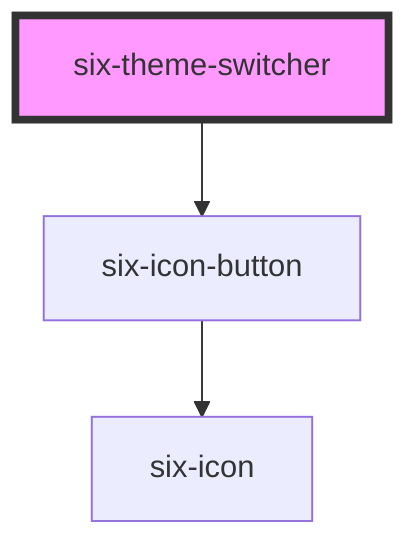

# six-theme-switcher

A simple icon button that toggles between light and dark themes. Works with six-root's theme management system.

<!-- EXAMPLES -->

<!-- Auto Generated Below -->

## Properties

| Property   | Attribute  | Description                                     | Type                                                                                | Default          |
| ---------- | ---------- | ----------------------------------------------- | ----------------------------------------------------------------------------------- | ---------------- |
| `disabled` | `disabled` | Set to true to disable the theme switcher.      | `boolean`                                                                           | `false`          |
| `label`    | `label`    | A description that gets read by screen readers. | `string`                                                                            | `'Toggle theme'` |
| `size`     | `size`     | The icon button's size.                         | `"large" \| "medium" \| "small" \| "xLarge" \| "xSmall" \| "xxLarge" \| "xxxLarge"` | `'medium'`       |

## Events

| Event                       | Description                        | Type                     |
| --------------------------- | ---------------------------------- | ------------------------ |
| `six-theme-switcher-change` | Emitted when the theme is changed. | `CustomEvent<undefined>` |

## Shadow Parts

| Part     | Description                   |
| -------- | ----------------------------- |
| `"base"` | The component's base wrapper. |

## Dependencies

### Depends on

- [six-icon-button](../six-icon-button)

### Graph

----------------------------------------------

Copyright © 2021-present SIX-Group
