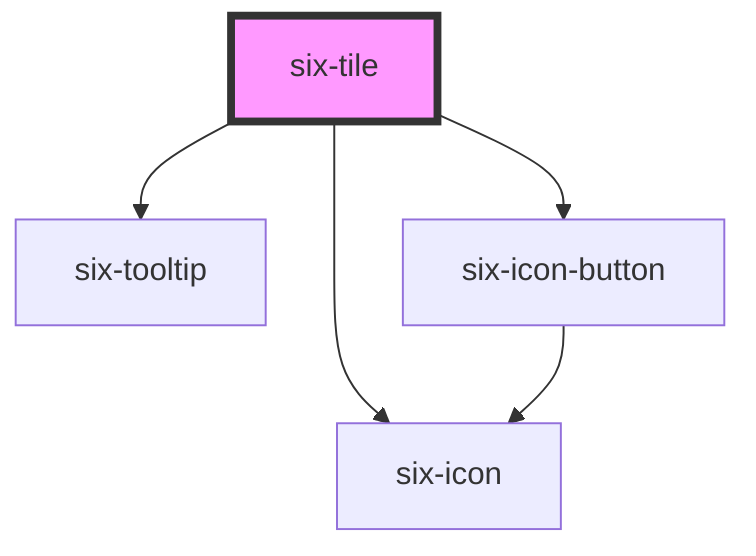

# six-tile

<!-- EXAMPLES -->

<!-- Auto Generated Below -->

## Properties

| Property         | Attribute         | Description                                  | Type                             | Default     |
| ---------------- | ----------------- | -------------------------------------------- | -------------------------------- | ----------- |
| `closeable`      | `closeable`       | Flag, whether the tile is closeable.         | `boolean`                        | `true`      |
| `disableTooltip` | `disable-tooltip` | Enables tile tooltip for tiles               | `boolean`                        | `true`      |
| `disabled`       | `disabled`        | Set to true to disable the tile.             | `boolean`                        | `false`     |
| `elevated`       | `elevated`        | Flag, whether the tile should cast a shadow. | `boolean`                        | `false`     |
| `iconName`       | `icon-name`       | The icon's name.                             | `any`                            | `undefined` |
| `label`          | `label`           | The tile's label.                            | `string`                         | `''`        |
| `size`           | `size`            | The tile's size.                             | `"large" \| "medium" \| "small"` | `'medium'`  |

## Events

| Event               | Description                        | Type                     |
| ------------------- | ---------------------------------- | ------------------------ |
| `six-tile-closed`   | Emitted when the tile was closed.  | `CustomEvent<undefined>` |
| `six-tile-selected` | Emitted when the tile is selected. | `CustomEvent<undefined>` |

## Methods

### `hide() => Promise<void>`

Hides the tile

#### Returns

Type: `Promise<void>`

### `show() => Promise<void>`

Shows the tile

#### Returns

Type: `Promise<void>`

## Shadow Parts

| Part       | Description |
| ---------- | ----------- |
| `"base"`   |             |
| `"body"`   |             |
| `"footer"` |             |
| `"header"` |             |

## Dependencies

### Depends on

- [six-tooltip](../six-tooltip)
- [six-icon-button](../six-icon-button)
- [six-icon](../six-icon)

### Graph

----------------------------------------------

Copyright © 2021-present SIX-Group
