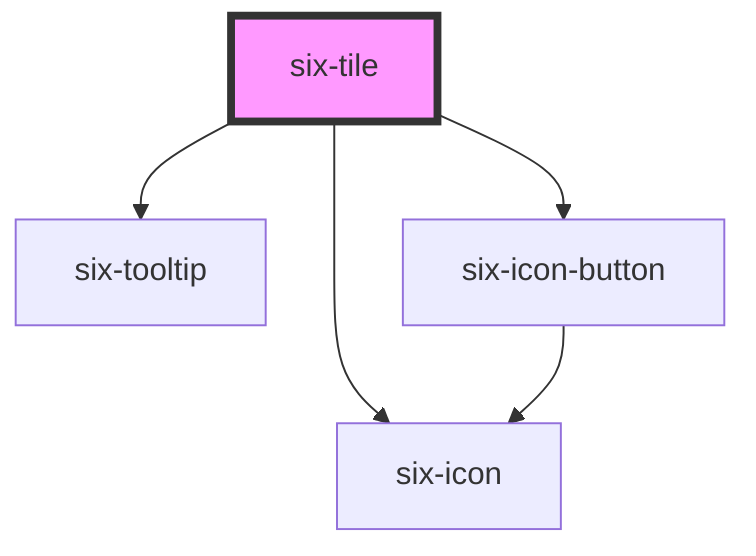

# six-tile

<!-- EXAMPLES -->

<!-- Auto Generated Below -->

## Properties

| Property         | Attribute         | Description                                                                                                                                                                                                                                                                                                                                                                                                                                                                                                                                                     | Type                                                  | Default     |
| ---------------- | ----------------- | --------------------------------------------------------------------------------------------------------------------------------------------------------------------------------------------------------------------------------------------------------------------------------------------------------------------------------------------------------------------------------------------------------------------------------------------------------------------------------------------------------------------------------------------------------------- | ----------------------------------------------------- | ----------- |
| `closeable`      | `closeable`       | Flag, whether the tile is closeable.                                                                                                                                                                                                                                                                                                                                                                                                                                                                                                                            | `boolean`                                             | `true`      |
| `disableTooltip` | `disable-tooltip` | Enables tile tooltip for tiles                                                                                                                                                                                                                                                                                                                                                                                                                                                                                                                                  | `boolean`                                             | `true`      |
| `disabled`       | `disabled`        | Set to true to disable the tile.                                                                                                                                                                                                                                                                                                                                                                                                                                                                                                                                | `boolean`                                             | `false`     |
| `elevated`       | `elevated`        | Flag, whether the tile should cast a shadow.                                                                                                                                                                                                                                                                                                                                                                                                                                                                                                                    | `boolean`                                             | `false`     |
| `iconName`       | `icon-name`       | The icon's name.                                                                                                                                                                                                                                                                                                                                                                                                                                                                                                                                                | `string \| undefined`                                 | `undefined` |
| `label`          | `label`           | The tile's label.                                                                                                                                                                                                                                                                                                                                                                                                                                                                                                                                               | `string`                                              | `''`        |
| `library`        | `library`         | Icon library to use when no `library` prop is provided. By default, all `<six-icon>` instances fall back to the globally configured default library (via `setDefaultIconLibrary()` / `getDefaultIconLibrary()`), which is `"material-icons"` unless changed at runtime.  This allows teams to switch the default across an entire project without having to set the `library` prop on every `<six-icon>` instance.  Icon library for this instance. Overrides the global default. - "material-icons"  → Material Icons - "material-symbols"  → Material Symbols | `"material-icons" \| "material-symbols" \| undefined` | `undefined` |
| `size`           | `size`            | The tile's size.                                                                                                                                                                                                                                                                                                                                                                                                                                                                                                                                                | `"large" \| "medium" \| "small"`                      | `'medium'`  |

## Events

| Event               | Description                        | Type                     |
| ------------------- | ---------------------------------- | ------------------------ |
| `six-tile-closed`   | Emitted when the tile was closed.  | `CustomEvent<undefined>` |
| `six-tile-selected` | Emitted when the tile is selected. | `CustomEvent<undefined>` |

## Methods

### `hide() => Promise<void>`

Hides the tile

#### Returns

Type: `Promise<void>`

### `show() => Promise<void>`

Shows the tile

#### Returns

Type: `Promise<void>`

## Shadow Parts

| Part       | Description |
| ---------- | ----------- |
| `"base"`   |             |
| `"body"`   |             |
| `"footer"` |             |
| `"header"` |             |

## Dependencies

### Depends on

- [six-tooltip](../six-tooltip)
- [six-icon-button](../six-icon-button)
- [six-icon](../six-icon)

### Graph

```mermaid
graph TD;
  six-tile --> six-tooltip
  six-tile --> six-icon-button
  six-tile --> six-icon
  six-icon-button --> six-icon
  style six-tile fill:#f9f,stroke:#333,stroke-width:4px
```

----------------------------------------------

Copyright © 2021-present SIX-Group
