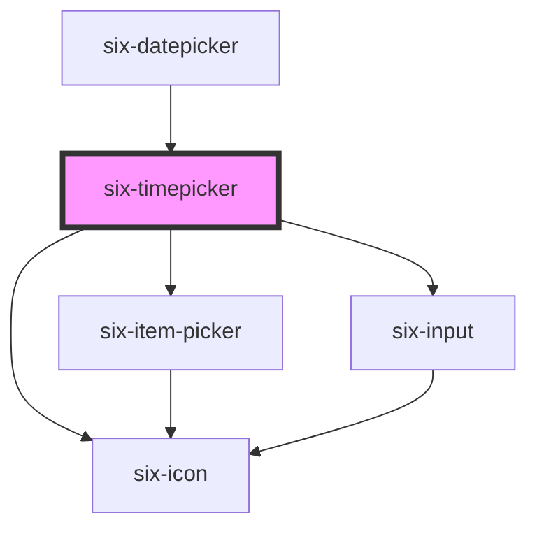

# six-time-picker

<!-- EXAMPLES -->

<!-- Auto Generated Below -->

## Properties

| Property       | Attribute       | Description                                                                                                                                                                                                                                                                                                                                                                           | Type                                                                                                                                   | Default                          |
| -------------- | --------------- | ------------------------------------------------------------------------------------------------------------------------------------------------------------------------------------------------------------------------------------------------------------------------------------------------------------------------------------------------------------------------------------- | -------------------------------------------------------------------------------------------------------------------------------------- | -------------------------------- |
| `clearable`    | `clearable`     | Set to true to add a clear button when the input is populated.                                                                                                                                                                                                                                                                                                                        | `boolean`                                                                                                                              | `false`                          |
| `debounce`     | `debounce`      | Set the amount of time, in milliseconds, to wait to trigger the `six-timepicker-change-debounced` event. If you want your change debounce event to not trigger when keeping the nav button pressed before, make sure debounce is a bit bigger than timeout, otherwise keeping the button pressed will trigger the event twice: once you click (and keep pressed) and once you release | `number`                                                                                                                               | `DEFAULT_DEBOUNCE_FAST`          |
| `defaultTime`  | `default-time`  | The defaultTime defines the default setting for the timepicker when you open the popup. Default time must match the provided format.                                                                                                                                                                                                                                                  | `string \| undefined`                                                                                                                  | `undefined`                      |
| `disabled`     | `disabled`      | If `true` the component is disabled.                                                                                                                                                                                                                                                                                                                                                  | `boolean`                                                                                                                              | `false`                          |
| `errorText`    | `error-text`    | The input's error text. Alternatively, you can use the error-text slot.                                                                                                                                                                                                                                                                                                               | `string`                                                                                                                               | `''`                             |
| `format`       | `format`        | Define the time format. Valid formats are:  HH:mm:ss hh:mm:ss:aa HH:mm:ss:ms hh:mm:ss:ms:aa HH:mm hh:mm:aa HH hh:aa mm ss ms  where HH is the 24 hour format and hh is the 12 hour format  Please notice that when using the 12-hour-clock (hh) you always need a period indicator (aa). So the time can be parsed as either am or pm                                                 | `"HH" \| "HH:mm" \| "HH:mm:ss" \| "HH:mm:ss:ms" \| "hh:aa" \| "hh:mm:aa" \| "hh:mm:ss:aa" \| "hh:mm:ss:ms:aa" \| "mm" \| "ms" \| "ss"` | `'HH:mm:ss'`                     |
| `hoist`        | `hoist`         | Enable this option to prevent the panel from being clipped when the component is placed inside a container with `overflow: auto\|scroll`.                                                                                                                                                                                                                                             | `boolean`                                                                                                                              | `false`                          |
| `iconPosition` | `icon-position` | Set the position of the icon                                                                                                                                                                                                                                                                                                                                                          | `"left" \| "right"`                                                                                                                    | `'left'`                         |
| `inline`       | `inline`        | Indicates whether the timepicker should be shown as an inline (always open) component                                                                                                                                                                                                                                                                                                 | `boolean`                                                                                                                              | `false`                          |
| `interval`     | `interval`      | Set the amount of time, in milliseconds, to wait between switching to next timeunit (e.g. next hour) when mouse button is held pressed.                                                                                                                                                                                                                                               | `number`                                                                                                                               | `DEFAULT_DEBOUNCE_INSANELY_FAST` |
| `invalid`      | `invalid`       | If this property is set to true and an error message is provided by `errorText`, the error message is displayed.                                                                                                                                                                                                                                                                      | `boolean`                                                                                                                              | `false`                          |
| `label`        | `label`         | The input's label. Alternatively, you can use the label slot.                                                                                                                                                                                                                                                                                                                         | `string`                                                                                                                               | `''`                             |
| `name`         | `name`          | The input's name attribute.                                                                                                                                                                                                                                                                                                                                                           | `string`                                                                                                                               | `''`                             |
| `open`         | `open`          | Indicates whether the timepicker dropdown is open on startup. You can use this in lieu of the show/hide methods.                                                                                                                                                                                                                                                                      | `boolean`                                                                                                                              | `false`                          |
| `placeholder`  | `placeholder`   | The placeholder defines what text to be shown on the input element                                                                                                                                                                                                                                                                                                                    | `string \| undefined`                                                                                                                  | `undefined`                      |
| `placement`    | `placement`     | The enforced placement of the dropdown panel.                                                                                                                                                                                                                                                                                                                                         | `"bottom" \| "top" \| undefined`                                                                                                       | `undefined`                      |
| `readonly`     | `readonly`      | If `true` the user can only select a time via the timepicker but not directly edit the input field.                                                                                                                                                                                                                                                                                   | `boolean`                                                                                                                              | `false`                          |
| `required`     | `required`      | Set to true to show an asterisk beneath the label.                                                                                                                                                                                                                                                                                                                                    | `boolean`                                                                                                                              | `false`                          |
| `separator`    | `separator`     | Define the separator to be shown between the time unit pickers. Please be aware that this property will modify the displayed separator only. The separator for a timestring is always expected to be a colon (eg. '13:52:20')                                                                                                                                                         | `string`                                                                                                                               | `':'`                            |
| `size`         | `size`          | Timepicker size.                                                                                                                                                                                                                                                                                                                                                                      | `"large" \| "medium" \| "small"`                                                                                                       | `'medium'`                       |
| `timeout`      | `timeout`       | Set the amount of time, in milliseconds, to wait to trigger faster switching between timeunits (e.g. hours).                                                                                                                                                                                                                                                                          | `number`                                                                                                                               | `DEFAULT_DEBOUNCE_FAST`          |
| `value`        | `value`         | The value of the timepicker provided as a string. The string mast match the provided format (or default format)                                                                                                                                                                                                                                                                       | `string`                                                                                                                               | `''`                             |

## Events

| Event                             | Description                                                | Type                               |
| --------------------------------- | ---------------------------------------------------------- | ---------------------------------- |
| `six-timepicker-change`           | Emitted when the timepicker's value changes                | `CustomEvent<SixTimepickerChange>` |
| `six-timepicker-change-debounced` | Emitted when the timepicker's value changes, but debounced | `CustomEvent<SixTimepickerChange>` |
| `six-timepicker-clear`            | Emitted when the clear button is activated.                | `CustomEvent<undefined>`           |

## Methods

### `setFocus(options?: FocusOptions) => Promise<void>`

Sets focus on the datepickers input.

#### Returns

Type: `Promise<void>`

## Shadow Parts

| Part          | Description                           |
| ------------- | ------------------------------------- |
| `"container"` | The container of whole component      |
| `"icon"`      |                                       |
| `"input"`     | The input field                       |
| `"popup"`     | The popup of the timepicker component |

## Dependencies

### Used by

 - [six-datepicker](../six-datepicker)

### Depends on

- [six-item-picker](../six-item-picker)
- [six-icon](../six-icon)
- [six-input](../six-input)

### Graph

----------------------------------------------

Copyright © 2021-present SIX-Group
