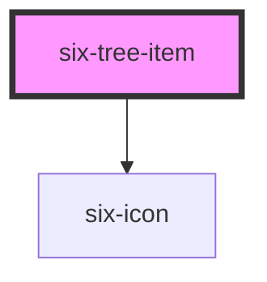

# six-tree-item

<!-- Auto Generated Below -->

## Properties

| Property   | Attribute  | Description                              | Type      | Default |
| ---------- | ---------- | ---------------------------------------- | --------- | ------- |
| `disabled` | `disabled` | Disables the tree item.                  | `boolean` | `false` |
| `expanded` | `expanded` | Expands the tree item.                   | `boolean` | `false` |
| `isLeaf`   | `is-leaf`  | internal                                 | `boolean` | `false` |
| `selected` | `selected` | Draws the tree item in a selected state. | `boolean` | `false` |

## Events

| Event                | Description | Type               |
| -------------------- | ----------- | ------------------ |
| `six-after-collapse` |             | `CustomEvent<any>` |
| `six-after-expand`   |             | `CustomEvent<any>` |
| `six-collapse`       |             | `CustomEvent<any>` |
| `six-expand`         |             | `CustomEvent<any>` |

## Slots

| Slot              | Description                                       |
| ----------------- | ------------------------------------------------- |
|                   | The default slot.                                 |
| `"collapse-icon"` | The icon to show when the tree item is collapsed. |
| `"expand-icon"`   | The icon to show when the tree item is expanded.  |

## Shadow Parts

| Part              | Description |
| ----------------- | ----------- |
| `"base"`          |             |
| `"children"`      |             |
| `"expand-button"` |             |
| `"indentation"`   |             |
| `"label"`         |             |

## Dependencies

### Depends on

- [six-icon](../six-icon)

### Graph

----------------------------------------------

Copyright © 2021-present SIX-Group
