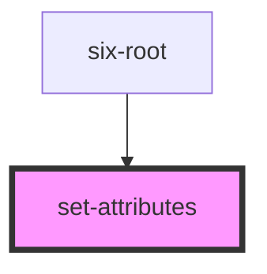

# set-attributes

<!-- EXAMPLES -->

<!-- Auto Generated Below -->

## Properties

| Property | Attribute | Description    | Type | Default |
| -------- | --------- | -------------- | ---- | ------- |
| `value`  | --        | Attributes map | `{}` | `{}`    |

## Dependencies

### Used by

 - [six-root](../../components/six-root)

### Graph

----------------------------------------------

Copyright © 2021-present SIX-Group
