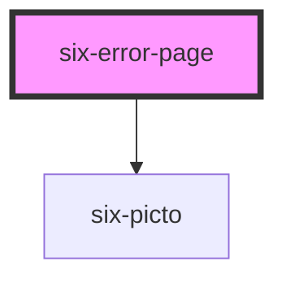

# six-error-pages

<!-- EXAMPLES -->

<!-- Auto Generated Below -->

## Properties

| Property            | Attribute      | Description                                                                        | Type           | Default     |
| ------------------- | -------------- | ---------------------------------------------------------------------------------- | -------------- | ----------- |
| `customDescription` | --             | Defines a custom description.                                                      | `string[]`     | `undefined` |
| `customIcon`        | `custom-icon`  | Defines a custom icon.                                                             | `string`       | `undefined` |
| `customTitle`       | `custom-title` | Defines a custom title.                                                            | `string`       | `undefined` |
| `errorCode`         | `error-code`   | Defines error Code and thus displays the proper error page.                        | `number`       | `undefined` |
| `language`          | `language`     | Defines language and thus displays the proper error page in the selected language. | `"de" \| "en"` | `'en'`      |

## Shadow Parts

| Part               | Description |
| ------------------ | ----------- |
| `"container"`      |             |
| `"description"`    |             |
| `"icon"`           |             |
| `"icon-container"` |             |
| `"title"`          |             |

## Dependencies

### Depends on

- [six-picto](../six-picto)

### Graph

----------------------------------------------

Copyright © 2021-present SIX-Group
