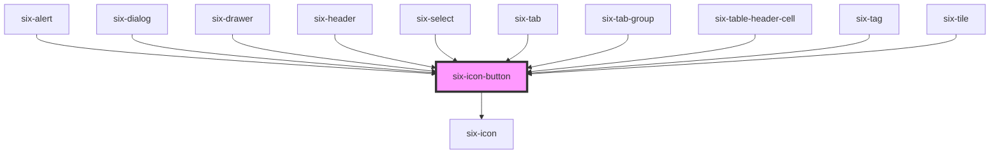

# six-icon-button
Icons buttons are simple, icon-only buttons that can be used for actions and in toolbars.

<!-- EXAMPLES -->

<!-- Auto Generated Below -->

## Properties

| Property   | Attribute  | Description                                                                                                                                                                        | Type                                                                                | Default     |
| ---------- | ---------- | ---------------------------------------------------------------------------------------------------------------------------------------------------------------------------------- | ----------------------------------------------------------------------------------- | ----------- |
| `disabled` | `disabled` | Set to true to disable the button.                                                                                                                                                 | `boolean`                                                                           | `false`     |
| `html`     | `html`     | HTML symbol code or entity.                                                                                                                                                        | `string`                                                                            | `undefined` |
| `label`    | `label`    | A description that gets read by screen readers and other assistive devices. For optimal accessibility, you should always include a label that describes what the icon button does. | `string`                                                                            | `undefined` |
| `name`     | `name`     | The name of the icon to draw.                                                                                                                                                      | `string`                                                                            | `undefined` |
| `size`     | `size`     | The icon's size.                                                                                                                                                                   | `"large" \| "medium" \| "small" \| "xLarge" \| "xSmall" \| "xxLarge" \| "xxxLarge"` | `'medium'`  |

## Shadow Parts

| Part     | Description                   |
| -------- | ----------------------------- |
| `"base"` | The component's base wrapper. |

## Dependencies

### Used by

 - [six-alert](../six-alert)
 - [six-dialog](../six-dialog)
 - [six-drawer](../six-drawer)
 - [six-header](../six-header)
 - [six-select](../six-select)
 - [six-tab](../six-tab)
 - [six-tab-group](../six-tab-group)
 - [six-table-header-cell](../six-table-header-cell)
 - [six-tag](../six-tag)
 - [six-tile](../six-tile)

### Depends on

- [six-icon](../six-icon)

### Graph

----------------------------------------------

Copyright © 2021-present SIX-Group
