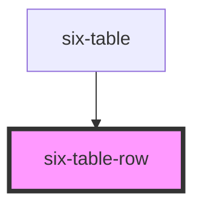

# six-table-row

<!-- EXAMPLES -->

<!-- Auto Generated Below -->

## Slots

| Slot | Description                          |
| ---- | ------------------------------------ |
|      | Used to define the cells of the row. |

## Dependencies

### Used by

 - [six-table](../six-table)

### Graph

----------------------------------------------

Copyright © 2021-present SIX-Group
