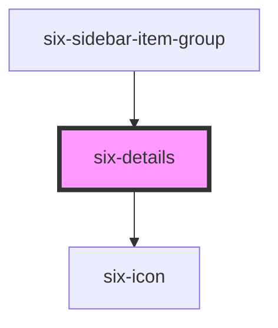

# six-details

<!-- EXAMPLES -->

<!-- Auto Generated Below -->

## Properties

| Property          | Attribute           | Description                                                                                                                                                | Type                                                                                             | Default     |
| ----------------- | ------------------- | ---------------------------------------------------------------------------------------------------------------------------------------------------------- | ------------------------------------------------------------------------------------------------ | ----------- |
| `disabled`        | `disabled`          | Set to true to prevent the user from toggling the details.                                                                                                 | `boolean`                                                                                        | `false`     |
| `hasContent`      | `has-content`       |                                                                                                                                                            | `boolean`                                                                                        | `true`      |
| `inline`          | `inline`            | Set to true when you want to use six-details inline e.g. in a sidebar                                                                                      | `boolean`                                                                                        | `false`     |
| `open`            | `open`              | Indicates whether or not the details is open. You can use this in lieu of the show/hide methods.                                                           | `boolean`                                                                                        | `false`     |
| `selectableEmpty` | `selectable-empty`  | Set to true when you want details without content to be selectable. This is important if you e.g. have a toggled sidebar where some menus have no children | `boolean`                                                                                        | `false`     |
| `summary`         | `summary`           | The summary to show in the details header. If you need to display HTML, use the `summary` slot instead.                                                    | `string`                                                                                         | `''`        |
| `summaryIcon`     | `summary-icon`      | The summary icon to show in the details header. If you need to display HTML, use the `summary-icon` slot instead.                                          | `string`                                                                                         | `undefined` |
| `summaryIconSize` | `summary-icon-size` | The icon's size.                                                                                                                                           | `"inherit" \| "large" \| "medium" \| "small" \| "xLarge" \| "xSmall" \| "xxLarge" \| "xxxLarge"` | `'inherit'` |

## Events

| Event                    | Description                                                                                          | Type                     |
| ------------------------ | ---------------------------------------------------------------------------------------------------- | ------------------------ |
| `six-details-after-hide` | Emitted after the details closes and all transitions are complete.                                   | `CustomEvent<undefined>` |
| `six-details-after-show` | Emitted after the details opens and all transitions are complete.                                    | `CustomEvent<undefined>` |
| `six-details-hide`       | Emitted when the details closes. Calling `event.preventDefault()` will prevent it from being closed. | `CustomEvent<undefined>` |
| `six-details-show`       | Emitted when the details opens. Calling `event.preventDefault()` will prevent it from being opened.  | `CustomEvent<undefined>` |

## Methods

### `hide() => Promise<void>`

Hides the detail body

#### Returns

Type: `Promise<void>`

### `show() => Promise<void>`

Shows the detail body

#### Returns

Type: `Promise<void>`

## Slots

| Slot        | Description                                                        |
| ----------- | ------------------------------------------------------------------ |
|             | The details' content.                                              |
| `"summary"` | The details' summary. Alternatively, you can use the summary prop. |

## Shadow Parts

| Part             | Description                       |
| ---------------- | --------------------------------- |
| `"base"`         | The component's base wrapper.     |
| `"content"`      | The details content.              |
| `"header"`       | The summary header.               |
| `"summary"`      | The details summary.              |
| `"summary-icon"` | The expand/collapse summary icon. |

## CSS Custom Properties

| Name                     | Description                                                  |
| ------------------------ | ------------------------------------------------------------ |
| `--hide-duration`        | The length of the hide transition.                           |
| `--hide-timing-function` | The timing function (easing) to use for the hide transition. |
| `--show-duration`        | The length of the show transition.                           |
| `--show-timing-function` | The timing function (easing) to use for the show transition. |

## Dependencies

### Used by

 - [six-sidebar-item-group](../six-sidebar-item-group)

### Depends on

- [six-icon](../six-icon)

### Graph

----------------------------------------------

Copyright © 2021-present SIX-Group
