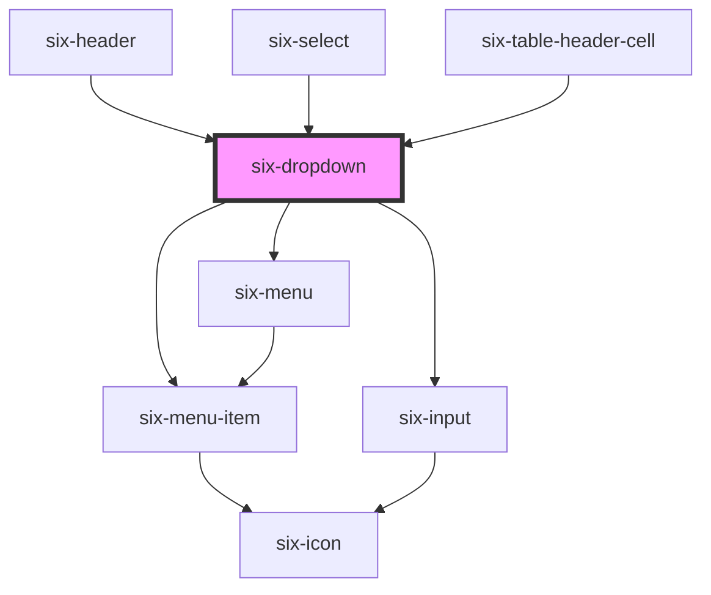

# six-dropdown

<!-- EXAMPLES -->

<!-- Auto Generated Below -->

## Properties

| Property                     | Attribute                         | Description                                                                                                                                                                                                                                                           | Type                                                                                                                                                                 | Default                 |
| ---------------------------- | --------------------------------- | --------------------------------------------------------------------------------------------------------------------------------------------------------------------------------------------------------------------------------------------------------------------- | -------------------------------------------------------------------------------------------------------------------------------------------------------------------- | ----------------------- |
| `asyncFilter`                | `async-filter`                    | Set to true to allow async filtering. When you enter something in the search field the component will only emit an event but not filter any elements itself. You can then simply listen to the 'six-async-filter-fired' event to manage the shown menu-items yourself | `boolean`                                                                                                                                                            | `false`                 |
| `autofocusFilter`            | `autofocus-filter`                | By default the search field will be focused when opening a dropdown with filtering enabled.                                                                                                                                                                           | `boolean`                                                                                                                                                            | `true`                  |
| `closeOnSelect`              | `close-on-select`                 | Determines whether the dropdown should hide when a menu item is selected.                                                                                                                                                                                             | `boolean`                                                                                                                                                            | `true`                  |
| `containingElement`          | --                                | The dropdown will close when the user interacts outside of this element (e.g. clicking).                                                                                                                                                                              | `HTMLElement`                                                                                                                                                        | `undefined`             |
| `disableHideOnEnterAndSpace` | `disable-hide-on-enter-and-space` | The panel can be opend/closed by pressing the spacebar or the enter key. In some cases you might want to avoid this                                                                                                                                                   | `boolean`                                                                                                                                                            | `false`                 |
| `distance`                   | `distance`                        | The distance in pixels from which to offset the panel away from its trigger.                                                                                                                                                                                          | `number`                                                                                                                                                             | `0`                     |
| `filter`                     | `filter`                          | Set to true to allow auto filtering for entries in the dropdown. With this flag the dropdown will automatically filter itsel. If you need to coordinate the shown elements yourself, e.g. because you need to call an endpoint use asyncFilter instead                | `boolean`                                                                                                                                                            | `false`                 |
| `filterDebounce`             | `filter-debounce`                 | The debounce for the filter callbacks.                                                                                                                                                                                                                                | `number`                                                                                                                                                             | `DEFAULT_DEBOUNCE_FAST` |
| `filterPlaceholder`          | `filter-placeholder`              | The filter's placeholder text.                                                                                                                                                                                                                                        | `string`                                                                                                                                                             | `'Filter...'`           |
| `hoist`                      | `hoist`                           | Enable this option to prevent the panel from being clipped when the component is placed inside a container with `overflow: auto\|scroll`.                                                                                                                             | `boolean`                                                                                                                                                            | `false`                 |
| `open`                       | `open`                            | Indicates whether or not the dropdown is open. You can use this in lieu of the show/hide methods.                                                                                                                                                                     | `boolean`                                                                                                                                                            | `false`                 |
| `options`                    | --                                | Set the options to be shown in the dropdown (alternative to setting the elements via html)                                                                                                                                                                            | `SixMenuItemData[]`                                                                                                                                                  | `null`                  |
| `placement`                  | `placement`                       | The preferred placement of the dropdown panel. Note that the actual placement may vary as needed to keep the panel inside of the viewport.                                                                                                                            | `"bottom" \| "bottom-end" \| "bottom-start" \| "left" \| "left-end" \| "left-start" \| "right" \| "right-end" \| "right-start" \| "top" \| "top-end" \| "top-start"` | `'bottom-start'`        |
| `skidding`                   | `skidding`                        | The distance in pixels from which to offset the panel along its trigger.                                                                                                                                                                                              | `number`                                                                                                                                                             | `0`                     |
| `virtualScroll`              | `virtual-scroll`                  | Defines whether the menu list will be rendered virtually i.e. only the elements actually shown (and a couple around) are actually rendered in the DOM. If you use virtual scrolling pass the elements via prop instead of via slot.                                   | `boolean`                                                                                                                                                            | `false`                 |

## Events

| Event                            | Description                                                                                           | Type                                         |
| -------------------------------- | ----------------------------------------------------------------------------------------------------- | -------------------------------------------- |
| `six-async-filter-fired`         | Emitted when the async filter is triggered                                                            | `CustomEvent<SixDropdownAsyncFilterPayload>` |
| `six-dropdown-after-hide`        | Emitted after the dropdown closes and all transitions are complete.                                   | `CustomEvent<undefined>`                     |
| `six-dropdown-after-show`        | Emitted after the dropdown opens and all transitions are complete.                                    | `CustomEvent<undefined>`                     |
| `six-dropdown-auto-filter-fired` | Emitted when the auto filter is triggered                                                             | `CustomEvent<SixDropdownAutoFilterPayload>`  |
| `six-dropdown-hide`              | Emitted when the dropdown closes. Calling `event.preventDefault()` will prevent it from being closed. | `CustomEvent<undefined>`                     |
| `six-dropdown-scroll`            | Emitted when the user scrolls inside dropdown panel.                                                  | `CustomEvent<SixDropdownScrollPayload>`      |
| `six-dropdown-show`              | Emitted when the dropdown opens. Calling `event.preventDefault()` will prevent it from being opened.  | `CustomEvent<undefined>`                     |

## Methods

### `hide() => Promise<void>`

Hides the dropdown panel

#### Returns

Type: `Promise<void>`

### `reposition() => Promise<void>`

Instructs the dropdown menu to reposition. Useful when the position or size of the trigger changes when the menu
is activated.

#### Returns

Type: `Promise<void>`

### `show() => Promise<void>`

Shows the dropdown panel

#### Returns

Type: `Promise<void>`

## Slots

| Slot        | Description                                               |
| ----------- | --------------------------------------------------------- |
|             | The dropdown's content.                                   |
| `"trigger"` | The dropdown's trigger, usually a `<six-button>` element. |

## Shadow Parts

| Part        | Description                                          |
| ----------- | ---------------------------------------------------- |
| `"base"`    | The component's base wrapper.                        |
| `"menu"`    |                                                      |
| `"panel"`   | The panel that gets shown when the dropdown is open. |
| `"trigger"` | The container that wraps the trigger.                |

## Dependencies

### Used by

 - [six-header](../six-header)
 - [six-select](../six-select)
 - [six-table-header-cell](../six-table-header-cell)

### Depends on

- [six-menu-item](../six-menu-item)
- [six-input](../six-input)
- [six-menu](../six-menu)

### Graph

----------------------------------------------

Copyright © 2021-present SIX-Group
