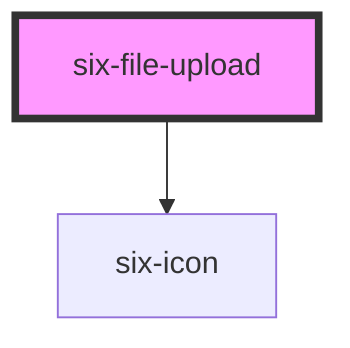

# six-file-upload

<!-- EXAMPLES -->

<!-- Auto Generated Below -->

## Properties

| Property      | Attribute       | Description                                  | Type      | Default     |
| ------------- | --------------- | -------------------------------------------- | --------- | ----------- |
| `accept`      | `accept`        | Accepted MIME-Types.                         | `string`  | `undefined` |
| `compact`     | `compact`       | Set to true if file control should be small. | `boolean` | `false`     |
| `disabled`    | `disabled`      | Set when button is disabled.                 | `boolean` | `false`     |
| `label`       | `label`         | Label of the drop area.                      | `string`  | `undefined` |
| `maxFileSize` | `max-file-size` | Allowed max file size in bytes.              | `number`  | `undefined` |
| `multiple`    | `multiple`      | More than one file allowed.                  | `boolean` | `undefined` |

## Events

| Event                     | Description                                                              | Type                                         |
| ------------------------- | ------------------------------------------------------------------------ | -------------------------------------------- |
| `six-file-upload-failure` | Triggers when an uploaded file doesn't match MIME type or max file size. | `CustomEvent<SixFileUploadFailurePayload>`   |
| `six-file-upload-success` | Triggers when a file is added.                                           | `CustomEvent<IMultipleFiles \| ISingleFile>` |

## Dependencies

### Depends on

- [six-icon](../six-icon)

### Graph

----------------------------------------------

Copyright © 2021-present SIX-Group
